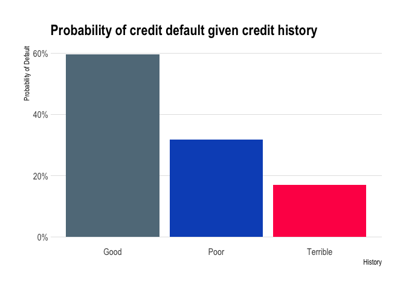

Exercise 02
================
Scott Cohn
Last compiled on 07 April, 2021

``` r
# funcs

read_data <- function(df) {
  #' read data from git url
  #' INPUT: data set name
  #' OUTPUT: dataframe
  full_path <- paste("https://raw.githubusercontent.com/jgscott/ECO395M/master/data/", 
                     df, sep = "")
  df <- read_csv(full_path)
  return(df)
}
```

## Visualization

``` r
capmetro <- read_data("capmetro_UT.csv") %>%
    # recode categorical vars
    mutate(day_of_week = factor(day_of_week,
                                levels = c("Mon", "Tue", "Wed","Thu",
                                           "Fri","Sat","Sun")),
           month = factor(month, levels = c("Sep", "Oct","Nov")))

# skimr::skim(capmetro)
```

``` r
p1 <- 
  capmetro %>%
    group_by(hour_of_day, day_of_week, month) %>%
    mutate(avg_boarding = mean(boarding)) %>%
    ungroup() %>%
    ggplot() +
    geom_line(aes(x = hour_of_day, y = avg_boarding, color = month)) +
    scale_x_continuous(expand = c(0,0), limits = c(0, 24), 
                       breaks = seq(10, 20, 5)) +
    scale_y_continuous(expand = c(0,0), limits = c(0, 160)) +
    scale_color_ft("Month") +
    facet_wrap(. ~ day_of_week, scales = "free") + 
    labs(x = "Hour of day", y = "Average boarding",
         title = "Average bus ridership around UT",
         subtitle = "Tracked by optical scanner",
         caption = "Source: Capital Metro") + 
    theme_ipsum(grid = "XY", axis = "xy") 

p1 <- flush_ticks(p1)
```

    ## theme(axis.text.x=element_text(hjust=c(0, rep(0.5, 1), 1))) +
    ## theme(axis.text.y=element_text(vjust=c(0, rep(0.5, 3), 1)))


This figure illustrates average CapMetro bus boardings (as tracked by
optical scanner) through the weekdays in the months of September,
October, and November.

The hour of peak boarding seems to stay relatively consistent. There
slight bumps early in the day, but hour 17 (5pm) seems to be
consistently higher. This makes sense because that is when most folks
get out of work. We see this does not hold for weekends, supporting the
hypothesis that these are work commutes.

The first Monday of September is Labor Day. This is a holiday, so
commutes are likely to be down. There are less holidays on WThF, so this
seems robust to my first hypothesis.

``` r
p2 <-
  capmetro %>%
    group_by(timestamp, hour_of_day) %>%
    mutate(avg_boarding = mean(boarding)) %>%
    ggplot() +
    geom_point(aes(x = temperature, y = avg_boarding, color = weekend)) +
    scale_x_continuous(expand = c(0,0), limits = c(30, 100), 
                       breaks = seq(40, 100, 20)) +
    scale_y_continuous(expand = c(0,0), limits = c(0, 300)) +
    scale_color_ft() +
    facet_wrap(. ~ hour_of_day, scales = "free") +  
    labs(x = "Temperature", y = "Boarding",
         title = "Average bus ridership around UT by temperature",
         subtitle = "Faceted by hour of day",
         caption = "Source: Capital Metro") + 
    theme_ipsum(grid = "XY", axis = "xy") +
    theme(legend.title = element_blank()) 

p2 <- flush_ticks(p2)
```

    ## theme(axis.text.x=element_text(hjust=c(0, rep(0.5, 2), 1))) +
    ## theme(axis.text.y=element_text(vjust=c(0, rep(0.5, 2), 1)))


This figure shows average ridership, by temperature, faceted by hour –
6am to 10pm – of the day (averaged by 15-minute increments) and colored
in gray for weekdays (M-F) and blue for weekends.

Riders seem pretty inelastic to changes in temperature. Their demand for
the bus seems relatively constant when holding all else fixed. Variation
in bus demand seems to primarily a function of time-of-day and, I would
conjecture, geographic location (Although we do not have data for this
latter point).

## Saratoga House Prices

### Report on findings

We constructed a predictive hedonic model that attempts to predict the
price of a house using a variety of structural and neighborhood
characteristics. The constructed model seems to perform quite well!
These data were relatively clean. To construct the model, we first
looked for null (missing) values. Fortunately, there were none. Then,
some of the features of the model were engineered for greater
performance. All of the numeric variables were standardized to a 0-1
range. We took the log of the price and created dummy variables for all
variables encoded as characters (e.g., `fuel` became `fuel_electric`,
`fuel_oil`, `fuel_gas` taking on 0/1 values). Then a linear and KNN
regression model were trained on 3 folds with no repeats. The linear
model was fit as-is. The KNN model has a single hyperparameter –
neigbors – that was tuned using a tuning grid. These models were then
fit on out-of-sample data. We handidly beat the given baseline. The KNN
model outperforms the linear model. This is probably due to the extra
ability for a KNN model to adapt to the non-linearities of these pricing
data.

See technical details and visualizations below.

RMSE to beat: 66257.83.

``` r
saratoga_houses <- mosaicData::SaratogaHouses

#skimr::skim(saratoga_houses)

# Histogtam of saratoga house prices
saratoga_houses %>%
  ggplot(aes(x = price)) +
  geom_histogram(bins = 50, fill = "dodgerblue", color = "black") + 
  labs(x = "Price", y = "Count",
     title = "Distribution of Price",
     subtitle = "Saratoga Houses",
     caption = "Source: MosaicData") +
  theme_ipsum(grid = "Y")
```

<!-- -->

### Build Model

We start with a very simple model. The first step is to create the
train/test split.

``` r
set.seed(395)
saratoga_split <- initial_split(saratoga_houses, strata = "price", prop = 0.75)

saratoga_train <- training(saratoga_split)
saratoga_test  <- testing(saratoga_split)

dim(saratoga_train)
```

    ## [1] 1298   16

``` r
dim(saratoga_split)
```

    ##   analysis assessment          n          p 
    ##       1298        430       1728         16

Let’s use cross-validation to split the training set into k-folds.

``` r
# 3 fold cross validation (for speed)
saratoga_vfold <- vfold_cv(saratoga_train, v = 3, repeats = 1, strata = "price")
```

We are interested in two different models, a linear regression model and
a KNN regression model. We start by creating the model specifications.

``` r
lm_spec <-
    linear_reg() %>%
    set_mode("regression") %>%
    set_engine("lm")

lm_spec
```

    ## Linear Regression Model Specification (regression)
    ## 
    ## Computational engine: lm

``` r
knn_spec <-
  nearest_neighbor(
    mode = "regression",
    neighbors = tune("K"),
  ) %>%
  set_engine("kknn")

knn_spec
```

    ## K-Nearest Neighbor Model Specification (regression)
    ## 
    ## Main Arguments:
    ##   neighbors = tune("K")
    ## 
    ## Computational engine: kknn

Next we put together a tidymodels `workflow()`:

``` r
# feature engineering
saratoga_wf <-
  workflow() %>%
  add_formula(price ~ .) %>%
    # log price
  step_log(price) %>%
  # mean impute numeric variables
  step_meanimpute(all_numeric(), -all_outcomes()) %>%
  # rescale all numeric variables to lie between 0 and 1
  step_range(all_numeric(), min = 0, max = 1) %>%
  # one-hot
  step_dummy(fuel, centralAir, heating, newConstruction, waterfront, sewer) %>%
  # remove predictor variables that are almost the same for every entry
  step_nzv(all_predictors()) 

saratoga_wf
```

    ## ══ Workflow ════════════════════════════════════════════════════════════════════
    ## Preprocessor: Formula
    ## Model: None
    ## 
    ## ── Preprocessor ────────────────────────────────────────────────────────────────
    ## price ~ .

There is no model yet. Now we can add a model, and fit to the resamples.

``` r
set.seed(350)
lm_rs <- 
  saratoga_wf %>%
  add_model(lm_spec) %>%
  fit_resamples(
    resamples = saratoga_vfold,
    control = control_resamples(save_pred = TRUE)
  )
```

Second, we can fit the KNN model. This one requires a bit more work.

``` r
set.seed(350)
# feature engineering
knn_rec <- 
  recipe(price ~ ., data = saratoga_train) %>%
  # log price
  step_log(price) %>%
  # mean impute numeric variables
  step_meanimpute(all_numeric(), -all_outcomes()) %>%
  # rescale all numeric variables to lie between 0 and 1
  step_range(all_numeric(), min = 0, max = 1) %>%
  # one-hot
  step_dummy(fuel, centralAir, heating, newConstruction, waterfront, sewer) %>%
  # remove predictor variables that are almost the same for every entry
  step_nzv(all_predictors()) 

# workflow
knn_wf <- 
  workflow() %>%
  add_model(knn_spec) %>%
  add_recipe(knn_rec)

# hyperparameter tuning
gridvals <- tibble(K = seq(1, 200))

knn_rs <- 
  knn_wf %>%
  tune_grid(
    resamples = saratoga_vfold,
    grid = gridvals,
    control = control_resamples(save_pred = TRUE)
  ) 

knn_rs
```

    ## # Tuning results
    ## # 3-fold cross-validation using stratification 
    ## # A tibble: 3 x 5
    ##   splits            id    .metrics          .notes          .predictions        
    ##   <list>            <chr> <list>            <list>          <list>              
    ## 1 <split [864/434]> Fold1 <tibble [400 × 5… <tibble [0 × 1… <tibble [86,800 × 5…
    ## 2 <split [866/432]> Fold2 <tibble [400 × 5… <tibble [0 × 1… <tibble [86,400 × 5…
    ## 3 <split [866/432]> Fold3 <tibble [400 × 5… <tibble [0 × 1… <tibble [86,400 × 5…

Now we have fit each of the candidate models to the resampled training
set. For the KNN regression, we take the *minimum* RMSE to find the best
setting for the number of neighbors.

``` r
set.seed(350)
# hyperparameter tuning
# show only the row of minimum RMSE
knn_min <- knn_rs %>%
  collect_metrics() %>% 
  filter(.metric == "rmse") %>%
  filter(mean == min(mean))

knn_min
```

    ## # A tibble: 1 x 7
    ##       K .metric .estimator   mean     n std_err .config               
    ##   <int> <chr>   <chr>       <dbl> <int>   <dbl> <chr>                 
    ## 1    26 rmse    standard   0.0692     3  0.0113 Preprocessor1_Model026

### Evaluate Model

First, we evaluate the linear regression model.

``` r
final_lm_wf <- 
  saratoga_wf %>%
  add_model(lm_spec) 
  
lm_fit <- 
  final_lm_wf %>%
  last_fit(split = saratoga_split)

lm_fit %>% collect_metrics()
```

    ## # A tibble: 2 x 4
    ##   .metric .estimator .estimate .config             
    ##   <chr>   <chr>          <dbl> <chr>               
    ## 1 rmse    standard   54702.    Preprocessor1_Model1
    ## 2 rsq     standard       0.698 Preprocessor1_Model1

``` r
lm_results <-
  lm_fit %>%
  collect_predictions()

# view results
lm_results
```

    ## # A tibble: 430 x 5
    ##    id                 .pred  .row  price .config             
    ##    <chr>              <dbl> <int>  <int> <chr>               
    ##  1 train/test split 224742.    11 325000 Preprocessor1_Model1
    ##  2 train/test split 200103.    12 120000 Preprocessor1_Model1
    ##  3 train/test split 128863.    20  87500 Preprocessor1_Model1
    ##  4 train/test split 119169.    21 112000 Preprocessor1_Model1
    ##  5 train/test split 342865.    29 457000 Preprocessor1_Model1
    ##  6 train/test split 199509.    34 227000 Preprocessor1_Model1
    ##  7 train/test split 228159.    36 169900 Preprocessor1_Model1
    ##  8 train/test split 174841.    43 150000 Preprocessor1_Model1
    ##  9 train/test split 261218.    44 234900 Preprocessor1_Model1
    ## 10 train/test split 296332.    45 279550 Preprocessor1_Model1
    ## # … with 420 more rows

Here we see the `rmse` for the linear model. It is quite large but
noticeably better than the provided script in class. Then, for the
linear model, we can look at coefficient estimates.

``` r
lm_fit$.workflow[[1]] %>% 
  tidy() %>% 
  kable(digits = 4, "pipe") 
```

| term                     |     estimate |  std.error | statistic | p.value |
|:-------------------------|-------------:|-----------:|----------:|--------:|
| (Intercept)              |  110452.4327 | 22076.2147 |    5.0032 |  0.0000 |
| lotSize                  |    6587.1637 |  2451.0359 |    2.6875 |  0.0073 |
| age                      |    -137.9241 |    67.0579 |   -2.0568 |  0.0399 |
| landValue                |       0.8981 |     0.0571 |   15.7178 |  0.0000 |
| livingArea               |      71.1150 |     5.5151 |   12.8947 |  0.0000 |
| pctCollege               |    -190.1991 |   177.2926 |   -1.0728 |  0.2836 |
| bedrooms                 |   -9022.9369 |  3052.7430 |   -2.9557 |  0.0032 |
| fireplaces               |    1626.0094 |  3483.2193 |    0.4668 |  0.6407 |
| bathrooms                |   23343.1081 |  4001.0320 |    5.8343 |  0.0000 |
| rooms                    |    3050.6021 |  1135.2484 |    2.6872 |  0.0073 |
| `heatinghot water/steam` |   -9791.4192 |  5014.3886 |   -1.9527 |  0.0511 |
| heatingelectric          |   -7016.1982 | 14930.4825 |   -0.4699 |  0.6385 |
| fuelelectric             |   -2981.2484 | 14813.5136 |   -0.2013 |  0.8405 |
| fueloil                  |   -8032.3326 |  5838.9342 |   -1.3757 |  0.1692 |
| `sewerpublic/commercial` |     -53.9954 |  4326.0363 |   -0.0125 |  0.9900 |
| sewernone                |    2123.0469 | 19226.6824 |    0.1104 |  0.9121 |
| waterfrontNo             | -112238.8294 | 16996.2006 |   -6.6038 |  0.0000 |
| newConstructionNo        |   43133.2298 |  8502.7876 |    5.0728 |  0.0000 |
| centralAirNo             |  -10904.7657 |  4090.0701 |   -2.6662 |  0.0078 |

And we can plot the results.

``` r
lm_results %>%
  #unnest(.predictions) %>%
  ggplot(aes(.pred, price)) +
  geom_abline(lty = 2, color = "tomato", size = 1) +
  geom_point(alpha = 0.5, color = "dodgerblue") +
  labs(
    title = 'Linear Regression Results - Saratoga Test Set',
    x = "Truth",
    y = "Predicted price",
    color = NULL
  ) + 
  theme_ipsum()
```

<!-- -->

Next, we evaluate the KNN model on out of sample data.

``` r
final_knn_wf <- 
  knn_wf %>% 
  finalize_workflow(knn_min)

knn_fit <- 
  final_knn_wf %>% 
  last_fit(split = saratoga_split)

knn_fit %>% collect_metrics()
```

    ## # A tibble: 2 x 4
    ##   .metric .estimator .estimate .config             
    ##   <chr>   <chr>          <dbl> <chr>               
    ## 1 rmse    standard   60649.    Preprocessor1_Model1
    ## 2 rsq     standard       0.635 Preprocessor1_Model1

``` r
# predictions
knn_results <- 
  knn_fit %>% 
  collect_predictions()

# view results
knn_results
```

    ## # A tibble: 430 x 5
    ##    id                 .pred  .row  price .config             
    ##    <chr>              <dbl> <int>  <int> <chr>               
    ##  1 train/test split 191651.    11 325000 Preprocessor1_Model1
    ##  2 train/test split 165831.    12 120000 Preprocessor1_Model1
    ##  3 train/test split 155146.    20  87500 Preprocessor1_Model1
    ##  4 train/test split 157185.    21 112000 Preprocessor1_Model1
    ##  5 train/test split 336896.    29 457000 Preprocessor1_Model1
    ##  6 train/test split 157869.    34 227000 Preprocessor1_Model1
    ##  7 train/test split 251174.    36 169900 Preprocessor1_Model1
    ##  8 train/test split 178011.    43 150000 Preprocessor1_Model1
    ##  9 train/test split 246459.    44 234900 Preprocessor1_Model1
    ## 10 train/test split 304254.    45 279550 Preprocessor1_Model1
    ## # … with 420 more rows

Above we see the model `rmse`, which is absurdly low. And we can plot
the results.

``` r
knn_results %>%
  #unnest(.predictions) %>%
  ggplot(aes(.pred, price)) +
  geom_abline(lty = 2, color = "tomato", size = 1) +
  geom_point(alpha = 0.5, color = "dodgerblue") +
  labs(
    title = 'KNN Regression Results - Saratoga Test Set',
    x = "Truth",
    y = "Predicted price",
    color = NULL
  ) + 
  theme_ipsum()
```

<!-- -->

## Classification and retrospective sampling

``` r
german_credit <- 
  read_data("german_credit.csv") %>% 
  select(-1) %>%
  # set outcome as factor 
  mutate(Default = as.factor(Default))
```

### Build logistic regression model

First, we create a bar-plot of the percentage of default by credit
history.

``` r
german_credit %>%
  group_by(Default, history) %>%
  add_tally() %>% 
  rename(num_default = n) %>% 
  distinct(history, num_default) %>%
  ungroup() %>%
  group_by(history) %>%
  mutate(tot_default = sum(num_default),
         prob_default = (num_default / tot_default) * 100) %>%
  filter(Default == 1) %>%
  ggplot() +
  geom_col(aes(x = history, y = prob_default, 
             fill = history)) + 
  scale_y_continuous(labels = function(x) paste0(x, "%")) +
  scale_x_discrete(labels = c("Good", "Poor", "Terrible")) +
  scale_fill_ft() +
  labs(x = "History", y = "Probability of Default",
       title = "Probability of credit default given credit history") +
  theme_ipsum(grid = "Y") + 
  theme(legend.title = element_blank(),
        legend.position = "None")
```

<!-- -->

Next, we create the train/test splits.

``` r
set.seed(395)
german_split <- initial_split(german_credit, strata = "Default", prop = 0.75)

german_train <- training(german_split)
german_test  <- testing(german_split)

# 3 fold cross validation (for speed)
german_vfold <- vfold_cv(german_train, v = 3, repeats = 1, strata = "Default")
german_vfold 
```

    ## #  3-fold cross-validation using stratification 
    ## # A tibble: 3 x 2
    ##   splits            id   
    ##   <list>            <chr>
    ## 1 <split [500/250]> Fold1
    ## 2 <split [500/250]> Fold2
    ## 3 <split [500/250]> Fold3

From the problem statement, we use the following features:

-   `duration + amount + installment + age + history + purpose + foreign`

So the first step is to construct the model engine.

``` r
log_spec <-
  logistic_reg(penalty = tune(), mixture = 1) %>% 
  set_engine("glmnet") %>% 
  set_mode("classification") 

log_spec
```

    ## Logistic Regression Model Specification (classification)
    ## 
    ## Main Arguments:
    ##   penalty = tune()
    ##   mixture = 1
    ## 
    ## Computational engine: glmnet

Next, we define a recipe and workflow.

``` r
set.seed(350)

# varlist to keep
varlist <- c("Default", "duration", "amount", "installment", "age", 
             "history", "purpose", "foreign")

# recipe // feature engineering
log_rec <- 
  recipe(Default ~ ., data = german_train) %>%
  # remove vars not in varlist
  step_rm(setdiff(colnames(german_credit), varlist)) %>%
  step_dummy(all_nominal(), -all_outcomes()) %>% 
  step_zv(all_predictors()) %>% 
  step_normalize(all_predictors())
  
# workflow
log_wf <- 
  workflow() %>%
  add_model(log_spec) %>%
  add_recipe(log_rec)
```

There is no model yet. Now we can add a model, and fit to the resamples.
First, we need to create the grid for tuning.

``` r
log_grid <- tibble(penalty = 10^seq(-4, -1, length.out = 30))
```

``` r
set.seed(350)

log_rs <- 
  log_wf %>% 
  tune_grid(german_vfold,
            grid = log_grid,
            control = control_grid(save_pred = TRUE),
            metrics = metric_set(roc_auc))

log_rs
```

    ## # Tuning results
    ## # 3-fold cross-validation using stratification 
    ## # A tibble: 3 x 5
    ##   splits            id    .metrics          .notes           .predictions       
    ##   <list>            <chr> <list>            <list>           <list>             
    ## 1 <split [500/250]> Fold1 <tibble [30 × 5]> <tibble [0 × 1]> <tibble [7,500 × 6…
    ## 2 <split [500/250]> Fold2 <tibble [30 × 5]> <tibble [0 × 1]> <tibble [7,500 × 6…
    ## 3 <split [500/250]> Fold3 <tibble [30 × 5]> <tibble [0 × 1]> <tibble [7,500 × 6…

We can look at the area under the ROC curve against the range of penalty
values.

``` r
log_rs %>% 
  collect_metrics() %>% 
  ggplot(aes(x = penalty, y = mean)) + 
  geom_point() + 
  geom_line() + 
  ylab("Area under the ROC Curve") +
  scale_x_log10(labels = scales::label_number()) + 
  theme_ipsum()
```

<!-- -->

Here we see that model performance is typically better at smaller
values. This indicates that the majority of predictors are important in
this model.

``` r
top_models <-
  log_rs %>% 
  show_best("roc_auc", n = 20) %>% 
  arrange(penalty) 

top_models %>% kbl(format = "pipe", booktabs = T)
```

|   penalty | .metric  | .estimator |      mean |   n |  std\_err | .config                |
|----------:|:---------|:-----------|----------:|----:|----------:|:-----------------------|
| 0.0001000 | roc\_auc | binary     | 0.7246730 |   3 | 0.0196172 | Preprocessor1\_Model01 |
| 0.0001269 | roc\_auc | binary     | 0.7246730 |   3 | 0.0196172 | Preprocessor1\_Model02 |
| 0.0001610 | roc\_auc | binary     | 0.7246730 |   3 | 0.0196172 | Preprocessor1\_Model03 |
| 0.0002043 | roc\_auc | binary     | 0.7246730 |   3 | 0.0196172 | Preprocessor1\_Model04 |
| 0.0002593 | roc\_auc | binary     | 0.7246730 |   3 | 0.0196172 | Preprocessor1\_Model05 |
| 0.0003290 | roc\_auc | binary     | 0.7246730 |   3 | 0.0196172 | Preprocessor1\_Model06 |
| 0.0004175 | roc\_auc | binary     | 0.7246730 |   3 | 0.0196172 | Preprocessor1\_Model07 |
| 0.0005298 | roc\_auc | binary     | 0.7246984 |   3 | 0.0196132 | Preprocessor1\_Model08 |
| 0.0006723 | roc\_auc | binary     | 0.7246222 |   3 | 0.0197046 | Preprocessor1\_Model09 |
| 0.0008532 | roc\_auc | binary     | 0.7246476 |   3 | 0.0197497 | Preprocessor1\_Model10 |
| 0.0010826 | roc\_auc | binary     | 0.7248762 |   3 | 0.0195814 | Preprocessor1\_Model11 |
| 0.0013738 | roc\_auc | binary     | 0.7248000 |   3 | 0.0196584 | Preprocessor1\_Model12 |
| 0.0017433 | roc\_auc | binary     | 0.7246730 |   3 | 0.0197155 | Preprocessor1\_Model13 |
| 0.0022122 | roc\_auc | binary     | 0.7250540 |   3 | 0.0197662 | Preprocessor1\_Model14 |
| 0.0028072 | roc\_auc | binary     | 0.7252317 |   3 | 0.0197574 | Preprocessor1\_Model15 |
| 0.0035622 | roc\_auc | binary     | 0.7252063 |   3 | 0.0194022 | Preprocessor1\_Model16 |
| 0.0045204 | roc\_auc | binary     | 0.7249270 |   3 | 0.0190850 | Preprocessor1\_Model17 |
| 0.0057362 | roc\_auc | binary     | 0.7245206 |   3 | 0.0192472 | Preprocessor1\_Model18 |
| 0.0072790 | roc\_auc | binary     | 0.7235048 |   3 | 0.0195592 | Preprocessor1\_Model19 |
| 0.0092367 | roc\_auc | binary     | 0.7223619 |   3 | 0.0201491 | Preprocessor1\_Model20 |

``` r
log_rs %>%
  select_best()
```

    ## # A tibble: 1 x 2
    ##   penalty .config              
    ##     <dbl> <chr>                
    ## 1 0.00281 Preprocessor1_Model15

It seems model 15 is our best choice. Let’s look at an ROC plot.

``` r
log_best <- 
  log_rs %>% 
  collect_metrics() %>% 
  arrange(penalty) %>% 
  slice(15)

log_auc <- 
  log_rs %>% 
  collect_predictions(parameters = log_best) %>% 
  roc_curve(Default, .pred_0) %>% 
  mutate(model = "Logistic Regression")

autoplot(log_auc)
```

<!-- -->

``` r
final_log_wf <- 
  log_wf %>% 
  finalize_workflow(log_best)

log_fit <- 
  final_log_wf %>% 
  last_fit(split = german_split)

log_fit %>% collect_metrics()
```

    ## # A tibble: 2 x 4
    ##   .metric  .estimator .estimate .config             
    ##   <chr>    <chr>          <dbl> <chr>               
    ## 1 accuracy binary         0.744 Preprocessor1_Model1
    ## 2 roc_auc  binary         0.724 Preprocessor1_Model1

``` r
# predictions
log_results <- 
  log_fit %>% 
  collect_predictions()

# view results
log_results
```

    ## # A tibble: 250 x 7
    ##    id               .pred_0 .pred_1  .row .pred_class Default .config           
    ##    <chr>              <dbl>   <dbl> <int> <fct>       <fct>   <chr>             
    ##  1 train/test split   0.858  0.142      9 0           0       Preprocessor1_Mod…
    ##  2 train/test split   0.605  0.395     11 0           1       Preprocessor1_Mod…
    ##  3 train/test split   0.857  0.143     17 0           0       Preprocessor1_Mod…
    ##  4 train/test split   0.846  0.154     22 0           0       Preprocessor1_Mod…
    ##  5 train/test split   0.941  0.0594    23 0           0       Preprocessor1_Mod…
    ##  6 train/test split   0.947  0.0533    25 0           0       Preprocessor1_Mod…
    ##  7 train/test split   0.911  0.0891    44 0           0       Preprocessor1_Mod…
    ##  8 train/test split   0.862  0.138     45 0           1       Preprocessor1_Mod…
    ##  9 train/test split   0.816  0.184     49 0           0       Preprocessor1_Mod…
    ## 10 train/test split   0.637  0.363     51 0           0       Preprocessor1_Mod…
    ## # … with 240 more rows

``` r
# ROC curve
log_results %>% 
  roc_curve(Default, .pred_0) %>% 
  autoplot()
```

<!-- -->

Next, we can look at a confusion matrix.

``` r
cm <- log_results %>%
  conf_mat(Default, .pred_class)

cm
```

    ##           Truth
    ## Prediction   0   1
    ##          0 163  52
    ##          1  12  23

This model is accurate 74.4 percent of the time. That’s not ideal. The
null model of assuming no one will default would be correct 70 percent
of the time (given the 700/300 split). These data are likely not ideal
for predicting, as previous credit history carries so much weight. I
would recommend the bank get a more balanced sample where defaults do
not lean so heavily on those with good credit. See the following:

``` r
german_credit %>% 
  group_by(history) %>% 
  tally() %>%
  kbl(format = "pipe")
```

| history  |   n |
|:---------|----:|
| good     |  89 |
| poor     | 618 |
| terrible | 293 |

The skew is pretty strong and the sampling is not balanced.

## Children and Hotel Reservations

``` r
hotels_dev <- 
  read_data("hotels_dev.csv") %>%
  mutate(children = as.factor(children))
```

First, we look at some proportions. How many stays included children?

``` r
hotels_dev %>%
  count(children) %>%
  mutate(prop = round( n/sum(n), 3)) %>%
  mutate(children = if_else(children == 1, "children", "none")) %>%
  kbl("pipe")
```

| children |     n |  prop |
|:---------|------:|------:|
| none     | 41365 | 0.919 |
| children |  3635 | 0.081 |

In this sample, children only make up about 8% of the sample. This can
be problematic. We could up or down sample here, but I have *not* done
that below.

``` r
hotel_splits <- initial_split(hotels_dev, strata = children)

hotel_train <- training(hotel_splits)
hotel_test <- testing(hotel_splits)

# validation set
train_val_set <- validation_split(hotel_train, strata = children, prop = 0.8)
```

We can also look at the proportions in our train/test split.

``` r
# train
hotel_train %>%
  count(children) %>%
  mutate(prop = round( n/sum(n), 3)) %>%
  mutate(children = if_else(children == 1, "children", "none")) %>%
  kbl("pipe")
```

| children |     n | prop |
|:---------|------:|-----:|
| none     | 31041 | 0.92 |
| children |  2709 | 0.08 |

``` r
# test
hotel_test %>%
  count(children) %>%
  mutate(prop = round( n/sum(n), 3)) %>%
  mutate(children = if_else(children == 1, "children", "none")) %>%
  kbl("pipe")
```

| children |     n |  prop |
|:---------|------:|------:|
| none     | 10324 | 0.918 |
| children |   926 | 0.082 |

Here we see the splits are similar in proportion for
children/no-children.

### Baseline models

Our first model will be a penalized logistic regression model since our
variable of interest is categorical. The area under the ROC curve will
be used to quantify how well the model performs across a continuum of
event thresholds

``` r
log_mod_base1 <- 
  logistic_reg(penalty = tune(), mixture = 1) %>%
  set_engine("glmnet")
```

For the first model, we will only use the following variables:
`market_segment`, `adults`, `customer_type`, and `is_repeated_guest`. We
start with feature engineering.

``` r
# Preprocess recipe
log_mod_base1_recipe <-
  recipe(children ~ market_segment + adults + customer_type + is_repeated_guest,
         data = hotel_train) %>%
  step_dummy(all_nominal(), -all_outcomes()) %>%
  # remove vars with a single value
  step_zv(all_predictors()) %>%
  step_normalize(all_predictors())

# Preprocess
log_mod_base1_wrkflow <-
  workflow() %>%
  add_model(log_mod_base1) %>%
  add_recipe(log_mod_base1_recipe)
```

Now, we have to tune only one hyperparameter here.

``` r
lr_reg_grid <- tibble(penalty = 10^seq(-4, -1, length.out = 30))

log_base1_res <- 
  log_mod_base1_wrkflow %>%
  tune_grid(train_val_set,
            grid = lr_reg_grid,
            control = control_grid(save_pred = T),
            metrics = metric_set(roc_auc))
```

``` r
# select the best model
log_base1_res %>% 
  select_best()
```

    ## # A tibble: 1 x 2
    ##    penalty .config              
    ##      <dbl> <chr>                
    ## 1 0.000418 Preprocessor1_Model07

``` r
best_mod_base1 <- 
  log_base1_res %>%
  collect_metrics() %>%
  slice(6)
```

``` r
# roc curve
log_base1_res %>%
  collect_predictions(parameters = best_mod_base1) %>%
  roc_curve(children, .pred_0) %>% 
  mutate(model = "Logistic Regression") %>%
  autoplot() 
```

<!-- -->

Yikes! Let’s show a confusion matrix:

``` r
param_final <- 
  log_base1_res %>%
  select_best(metric = "roc_auc")

log_mod_base1_wrkflow <-
  log_mod_base1_wrkflow %>% 
  finalize_workflow(param_final)

base1_fit <- 
  log_mod_base1_wrkflow %>%
  last_fit(hotel_splits)

base1_pred <-
  base1_fit %>%
  collect_predictions()

base1_pred %>% 
  conf_mat(truth = children, estimate = .pred_class)
```

    ##           Truth
    ## Prediction     0     1
    ##          0 10324   926
    ##          1     0     0

Okay this is pretty far off! Now let’s do the same thing but with all of
the other predictors (except `arrival_date`). This will be baseline
model 2.

Let’s start with the feature engineering.

``` r
# Preprocess recipe
holidays <- c("AllSouls", "AshWednesday", "ChristmasEve", "Easter", 
              "ChristmasDay", "GoodFriday", "NewYearsDay", "PalmSunday")

log_mod_base2_recipe <-
  recipe(children ~ .,
         data = hotel_train) %>%
  #step_downsample(children) %>%
  step_date(arrival_date) %>% 
  step_holiday(arrival_date, holidays = holidays) %>% 
  step_rm(arrival_date) %>% 
  step_dummy(all_nominal(), -all_outcomes()) %>%
  # remove vars with a single value
  step_zv(all_predictors()) %>%
  step_normalize(all_predictors())

# Preprocess
log_mod_base2_wrkflow <-
  workflow() %>%
  add_model(log_mod_base1) %>%
  add_recipe(log_mod_base2_recipe)
```

Again, we have to tune only one hyperparameter here.

``` r
log_base2_res <- 
  log_mod_base2_wrkflow %>%
  tune_grid(train_val_set,
            grid = lr_reg_grid,
            control = control_grid(save_pred = T),
            metrics = metric_set(roc_auc))
```

Then we can plot the penalty values against the area under the ROC
curve.

``` r
log_base2_res %>% 
  collect_metrics() %>% 
  ggplot(aes(x = penalty, y = mean)) + 
  geom_point() + 
  geom_line() + 
  ylab("Area under the ROC Curve") +
  scale_x_log10(labels = scales::label_number()) + 
  theme_clean()
```

<!-- -->

``` r
# select the best model
log_base2_res %>% 
  select_best()
```

    ## # A tibble: 1 x 2
    ##   penalty .config              
    ##     <dbl> <chr>                
    ## 1 0.00174 Preprocessor1_Model13

``` r
best_mod_base2 <- 
  log_base1_res %>%
  collect_metrics() %>%
  slice(2)
```

``` r
# roc curve
log_base2_res %>%
  collect_predictions(parameters = best_mod_base2) %>%
  roc_curve(children, .pred_0) %>% 
  mutate(model = "Logistic Regression") %>%
  autoplot() 
```

<!-- -->

This is not fabulous but it is quite a bit better than the first model.
We can then look at confusion matrices.

``` r
param_final <- 
  log_base2_res %>%
  select_best(metric = "roc_auc")

log_mod_base2_wrkflow <-
  log_mod_base2_wrkflow %>% 
  finalize_workflow(param_final)

base2_fit <- 
  log_mod_base2_wrkflow %>%
  last_fit(hotel_splits)

base2_pred <-
  base2_fit %>%
  collect_predictions()

base2_pred %>% 
  conf_mat(truth = children, estimate = .pred_class)
```

    ##           Truth
    ## Prediction     0     1
    ##          0 10219   624
    ##          1   105   302

This is quite a bit better. This specification is now predicting that
children are real and do in fact show up. This is better!

### Best Linear Model

Now let’s build a better linear model using the `dev` dataset. We can
use train/test splits as the previous models and later fit the model to
the validation set, `hotel_val.csv`, which was not used to train the
model.

``` r
set.seed(395)

# train/test
hotel_splits2 <- initial_split(hotels_dev, strata = children)

hotel_train2 <- training(hotel_splits2)
hotel_test2 <- testing(hotel_splits2)

# cross-val folds
hotel_cv <- vfold_cv(hotel_train2, v = 10, repeats = 1, strata = children)

# validation set
hotels_val <- read_data("hotels_val.csv") %>%
  mutate(children = as.factor(children))

log_mod_rec <-
  recipe(children ~ .,
         data = hotel_train2) %>%
  #step_downsample(children) %>%
  step_date(arrival_date) %>% 
  step_holiday(arrival_date, holidays = timeDate::listHolidays("US")) %>% 
  step_rm(arrival_date) %>% 
  step_dummy(all_nominal(), -all_outcomes()) %>%
  # remove vars with a single value
  step_zv(all_predictors()) %>%
  step_normalize(all_predictors())

log_mod <- 
  logistic_reg(penalty = tune(), mixture = 1) %>%
  set_engine("glmnet")

# Preprocess
log_mod_wrkflow <-
  workflow() %>%
  add_model(log_mod) %>%
  add_recipe(log_mod_rec)

# fit to the validation set
hotel_res <-
  log_mod_wrkflow %>%
  tune_grid(grid = lr_reg_grid,
            resamples = hotel_cv,
            control = control_grid(save_pred = T),
            metrics = metric_set(roc_auc))

top_models <-
  hotel_res %>% 
  show_best("roc_auc", n = 15) %>% 
  arrange(penalty) 

hotel_best <- 
  hotel_res %>% 
  collect_metrics() %>% 
  arrange(penalty) %>% 
  slice(12)
```

Here are the model metrics.

``` r
hotel_best %>% kbl("pipe")
```

|   penalty | .metric  | .estimator |     mean |   n |  std\_err | .config                |
|----------:|:---------|:-----------|---------:|----:|----------:|:-----------------------|
| 0.0013738 | roc\_auc | binary     | 0.874795 |  10 | 0.0033483 | Preprocessor1\_Model12 |

Here is the ROC curve for one of the fitted models (on the `hotel_dev`
test set).

``` r
# roc curve
hotel_res %>%
  collect_predictions(parameters = hotel_best) %>%
  roc_curve(children, .pred_0) %>% 
  mutate(model = "Logistic Regression") %>%
  autoplot() 
```

<!-- -->

### Model Validation 1

Now we finalize the workflow and test the model on the `hotel_val` set.
We report a confusion matrix and ROC curve below.

``` r
trained_wf <-
  log_mod_wrkflow %>%
  finalize_workflow(hotel_best) %>%
  fit(hotels_dev)

hotel_preds <-
  trained_wf %>%
  predict(hotels_val) %>%
  bind_cols(hotels_val %>% select(children))

hotel_final_pred <- 
  trained_wf %>%
  predict(hotels_val, type = "prob") %>%
  bind_cols(hotel_preds)

hotel_final_pred %>%
  conf_mat(truth = children, .pred_class)
```

    ##           Truth
    ## Prediction    0    1
    ##          0 4542  261
    ##          1   55  141

``` r
hotel_final_pred %>% 
  roc_curve(children, .pred_0) %>% 
  mutate(model = "Logistic Regression") %>%
  autoplot()
```

<!-- -->

### Model Validation 2

``` r
# create v-folds
hotel_folds <- vfold_cv(hotels_val, v = 20)
```

Then we can fit the v-folds:

``` r
hotel_fold_fit <- 
  #log_mod_base2_wrkflow %>%
  trained_wf %>%
  fit_resamples(
    resamples = hotel_folds,
    control = control_resamples(save_pred = TRUE)
  )
```

Next, we sum up the predicted probabilities for all the bookings in the
fold. This gives an estimate of the expected number of bookings with
children for that fold.

``` r
# predicted probabilities
pred_sums <- list()

for (i in 1:20) {
  pred_sums <-
    hotel_fold_fit$.predictions[[i]] %>%
    summarize(sum_pred = sum(as.numeric(.pred_class))) %>%
    pull(sum_pred) %>% 
    append(pred_sums)
}

# actual probs
actual_sums <- list()

for (i in 1:20) {
  actual_sums <-
    hotel_fold_fit$.predictions[[i]] %>%
    summarize(sum_actual = sum(as.numeric(children))) %>%
    pull(sum_actual) %>% 
    append(actual_sums)
}

# colnames
names <- tibble("Folds" = c("Actual", "Predicted"))

# join pred and actual
probs <-
  as.tibble(actual_sums, .name_repair = "unique") %>% 
  rbind(as.tibble(pred_sums, .name_repair = "unique")) 

# print as table with names
cbind(names, probs) %>%
  kable(col.names = 
          append("Folds", make.unique(c("Folds", rep("v", 21)), sep = "")[3:22]),
      caption = "Sum of probabilities")
```

<table>
<caption>
Sum of probabilities
</caption>
<thead>
<tr>
<th style="text-align:left;">
Folds
</th>
<th style="text-align:right;">
v1
</th>
<th style="text-align:right;">
v2
</th>
<th style="text-align:right;">
v3
</th>
<th style="text-align:right;">
v4
</th>
<th style="text-align:right;">
v5
</th>
<th style="text-align:right;">
v6
</th>
<th style="text-align:right;">
v7
</th>
<th style="text-align:right;">
v8
</th>
<th style="text-align:right;">
v9
</th>
<th style="text-align:right;">
v10
</th>
<th style="text-align:right;">
v11
</th>
<th style="text-align:right;">
v12
</th>
<th style="text-align:right;">
v13
</th>
<th style="text-align:right;">
v14
</th>
<th style="text-align:right;">
v15
</th>
<th style="text-align:right;">
v16
</th>
<th style="text-align:right;">
v17
</th>
<th style="text-align:right;">
v18
</th>
<th style="text-align:right;">
v19
</th>
<th style="text-align:right;">
v20
</th>
</tr>
</thead>
<tbody>
<tr>
<td style="text-align:left;">
Actual
</td>
<td style="text-align:right;">
266
</td>
<td style="text-align:right;">
266
</td>
<td style="text-align:right;">
270
</td>
<td style="text-align:right;">
271
</td>
<td style="text-align:right;">
284
</td>
<td style="text-align:right;">
271
</td>
<td style="text-align:right;">
269
</td>
<td style="text-align:right;">
267
</td>
<td style="text-align:right;">
269
</td>
<td style="text-align:right;">
271
</td>
<td style="text-align:right;">
272
</td>
<td style="text-align:right;">
273
</td>
<td style="text-align:right;">
267
</td>
<td style="text-align:right;">
268
</td>
<td style="text-align:right;">
273
</td>
<td style="text-align:right;">
266
</td>
<td style="text-align:right;">
271
</td>
<td style="text-align:right;">
268
</td>
<td style="text-align:right;">
265
</td>
<td style="text-align:right;">
274
</td>
</tr>
<tr>
<td style="text-align:left;">
Predicted
</td>
<td style="text-align:right;">
253
</td>
<td style="text-align:right;">
261
</td>
<td style="text-align:right;">
257
</td>
<td style="text-align:right;">
260
</td>
<td style="text-align:right;">
265
</td>
<td style="text-align:right;">
265
</td>
<td style="text-align:right;">
260
</td>
<td style="text-align:right;">
257
</td>
<td style="text-align:right;">
258
</td>
<td style="text-align:right;">
261
</td>
<td style="text-align:right;">
261
</td>
<td style="text-align:right;">
255
</td>
<td style="text-align:right;">
258
</td>
<td style="text-align:right;">
260
</td>
<td style="text-align:right;">
264
</td>
<td style="text-align:right;">
261
</td>
<td style="text-align:right;">
258
</td>
<td style="text-align:right;">
258
</td>
<td style="text-align:right;">
262
</td>
<td style="text-align:right;">
261
</td>
</tr>
</tbody>
</table>

We can also plot it to see it more visually.

``` r
tibble(fold = seq(1, 20, 1), 
       Actual = unlist(actual_sums), 
       Prediction = unlist(pred_sums)) %>%
  pivot_longer(!fold, names_to = "names", values_to = "vals") %>%
  ggplot() +
  geom_point(aes(x = fold, y = vals, color = names))  + 
  labs(x = "Fold", y = "Sum of probabilies") + 
  scale_x_continuous(breaks = seq(1, 20, 1)) +
  scale_color_brewer(palette = "Set1") + 
  theme_clean() + 
  theme(legend.title = element_blank())
```

<!-- -->

This seems to do okay across folds!

``` r
mean_err <- sum(probs[1,] - probs[2,]) / 20

glue::glue("The average mean error is {mean_err}")
```

    ## The average mean error is 10.3

## Session Information

``` r
sessionInfo()
```

    ## R version 4.0.3 (2020-10-10)
    ## Platform: x86_64-apple-darwin17.0 (64-bit)
    ## Running under: macOS Big Sur 10.16
    ## 
    ## Matrix products: default
    ## BLAS:   /Library/Frameworks/R.framework/Versions/4.0/Resources/lib/libRblas.dylib
    ## LAPACK: /Library/Frameworks/R.framework/Versions/4.0/Resources/lib/libRlapack.dylib
    ## 
    ## locale:
    ## [1] en_US.UTF-8/en_US.UTF-8/en_US.UTF-8/C/en_US.UTF-8/en_US.UTF-8
    ## 
    ## attached base packages:
    ## [1] stats     graphics  grDevices utils     datasets  methods   base     
    ## 
    ## other attached packages:
    ##  [1] vctrs_0.3.4                rlang_0.4.10              
    ##  [3] mosaic_1.8.2               ggridges_0.5.2            
    ##  [5] mosaicData_0.18.0          ggformula_0.9.4           
    ##  [7] ggstance_0.3.4             lattice_0.20-41           
    ##  [9] gcookbook_2.0              kableExtra_1.2.1          
    ## [11] hrbrthemes_0.8.0           patchwork_1.1.1           
    ## [13] glmnet_4.1                 Matrix_1.2-18             
    ## [15] kknn_1.3.1                 skimr_2.1.2               
    ## [17] tidyquant_1.0.2            quantmod_0.4.18           
    ## [19] TTR_0.24.2                 PerformanceAnalytics_2.0.4
    ## [21] xts_0.12-0                 zoo_1.8-8                 
    ## [23] lubridate_1.7.8            yardstick_0.0.7           
    ## [25] workflows_0.2.1            tune_0.1.2                
    ## [27] rsample_0.0.8              recipes_0.1.15            
    ## [29] parsnip_0.1.5              modeldata_0.1.0           
    ## [31] infer_0.5.4                dials_0.0.9               
    ## [33] scales_1.1.1               broom_0.7.3               
    ## [35] tidymodels_0.1.2           forcats_0.5.0             
    ## [37] stringr_1.4.0              dplyr_1.0.2               
    ## [39] purrr_0.3.4                readr_1.3.1               
    ## [41] tidyr_1.1.2                tibble_3.0.5              
    ## [43] ggplot2_3.3.3              tidyverse_1.3.0           
    ## 
    ## loaded via a namespace (and not attached):
    ##   [1] readxl_1.3.1       backports_1.1.6    systemfonts_0.3.2 
    ##   [4] tidytext_0.2.5     plyr_1.8.6         igraph_1.2.6      
    ##   [7] repr_1.1.0         splines_4.0.3      crosstalk_1.1.0.1 
    ##  [10] leaflet_2.0.3      listenv_0.8.0      SnowballC_0.7.0   
    ##  [13] digest_0.6.27      foreach_1.5.0      htmltools_0.4.0   
    ##  [16] fansi_0.4.1        magrittr_2.0.1     mosaicCore_0.8.0  
    ##  [19] globals_0.14.0     modelr_0.1.7       gower_0.2.2       
    ##  [22] extrafont_0.17     wordcloud_2.6      extrafontdb_1.0   
    ##  [25] hardhat_0.1.5      colorspace_1.4-1   ggrepel_0.9.1     
    ##  [28] blob_1.2.1         rvest_0.3.6        haven_2.2.0       
    ##  [31] xfun_0.21          crayon_1.3.4       jsonlite_1.7.1    
    ##  [34] survival_3.2-7     iterators_1.0.12   glue_1.4.2        
    ##  [37] polyclip_1.10-0    gtable_0.3.0       ipred_0.9-9       
    ##  [40] webshot_0.5.2      Quandl_2.10.0      Rttf2pt1_1.3.8    
    ##  [43] shape_1.4.4        DBI_1.1.0          Rcpp_1.0.4.6      
    ##  [46] viridisLite_0.3.0  GPfit_1.0-8        statquotes_0.2.2  
    ##  [49] lava_1.6.8.1       prodlim_2019.11.13 htmlwidgets_1.5.1 
    ##  [52] httr_1.4.2         RColorBrewer_1.1-2 ellipsis_0.3.1    
    ##  [55] farver_2.0.3       pkgconfig_2.0.3    nnet_7.3-14       
    ##  [58] dbplyr_1.4.4       utf8_1.1.4         labeling_0.3      
    ##  [61] tidyselect_1.1.0   DiceDesign_1.8-1   munsell_0.5.0     
    ##  [64] cellranger_1.1.0   tools_4.0.3        cli_2.2.0         
    ##  [67] generics_0.1.0     ggdendro_0.1-20    evaluate_0.14     
    ##  [70] yaml_2.2.1         knitr_1.30         fs_1.4.1          
    ##  [73] future_1.21.0      xml2_1.3.2         tokenizers_0.2.1  
    ##  [76] compiler_4.0.3     rstudioapi_0.13    curl_4.3          
    ##  [79] reprex_0.3.0       tweenr_1.0.1       lhs_1.1.1         
    ##  [82] stringi_1.5.3      highr_0.8          gdtools_0.2.2     
    ##  [85] pillar_1.4.4       lifecycle_0.2.0    furrr_0.2.1       
    ##  [88] R6_2.4.1           gridExtra_2.3      janeaustenr_0.1.5 
    ##  [91] parallelly_1.23.0  codetools_0.2-16   MASS_7.3-53       
    ##  [94] assertthat_0.2.1   withr_2.2.0        parallel_4.0.3    
    ##  [97] hms_0.5.3          quadprog_1.5-8     grid_4.0.3        
    ## [100] rpart_4.1-15       timeDate_3043.102  class_7.3-17      
    ## [103] rmarkdown_2.5      ggforce_0.3.1      pROC_1.17.0.1     
    ## [106] base64enc_0.1-3
