Exercise 03
================
Scott Cohn
Last compiled on 04 April, 2021

``` r
# funcs
read_data <- function(df) {
  #' read data from git url
  #' INPUT: data set name
  #' OUTPUT: dataframe
  full_path <- paste("https://raw.githubusercontent.com/jgscott/ECO395M/master/data/", 
                     df, sep = "")
  df <- read_csv(full_path)
  return(df)
}
```

## What Causes What?

> *Listen to [this podcast](https://www.npr.org/transcripts/178635250)
> and answer the following.*

### Q1

> *Why can’t I just get data from a few different cities and run the
> regression of “Crime” on “Police” to understand how more cops in the
> streets affect crime? (“Crime” refers to some measure of crime rate
> and “Police” measures the number of cops in a city.)*

*Will hiring more cops cause crime to go down?* This is a causal
question. There are feedback effects, too. Cities with high crime may
have an incentive to hire more cops. Cities with low crime may have
fewer cops. However, the direction could go the other way. Either way
not all cities are “equal”. There are many confounding factors, so in
the end you would have to control for city either way. And, the change
in police is not random. This makes causal identification messy.

### Q2

> *How were the researchers from UPenn able to isolate this effect?
> Briefly describe their approach and discuss their result in the “Table
> 2” below, from the researchers’ paper.*

|                       | \(1\)    | \(2\)        |
|-----------------------|----------|--------------|
| High Alert            | -7.316\* | -6.046\*     |
|                       | (2.877)  | (2.537)      |
| Log(midday ridership) |          | 17.341\*\*\* |
|                       |          | (5.309)      |
| R-sq                  | 0.14     | 0.17         |

The researchers wanted to find a way to get a lot of police unrelated to
crime. The researchers found the terrorism alert system. When the alert
system goes to orange, there are extra police put on the Mall and other
parts of Washington. This is independent of street crime. They found
extra police is associated with lower levels of murder, robbery, and
other street crimes. So looking at model (1), we see that when the
system is on “high alert” we see crime go down. (The units are unclear
from the table alone.) I comment on model (2) in the next question.

### Q3

> *Why did they have to control for Metro ridership? What was that
> trying to capture?*

It’s possible that there were less people and tourists on the street due
to the alert. The researchers checked for this by looking at ridership
levels on the Metro and found that the ridership was largely unchanged.
Adding ridership (well `Log(midday ridership)`) to model (2), we see
that controlling for ridership diminishes the effect of the high alert
slightly, but the effect remains significant.

### Q4

> *Below I am showing you “Table 4” from the researchers’ paper. Just
> focus on the first column of the table. Can you describe the model
> being estimated here? What is the conclusion?*

|                              | Coefficient |
|------------------------------|-------------|
| High Alert x District 1      | -2.621\*\*  |
|                              | (.044)      |
| High Alert x Other Districts | -.571       |
|                              | (.455)      |
| Log(midday ridership)        | 2.477\*     |
|                              | (.364)      |
| Constant                     | -11.058\*\* |
|                              | (4.211)     |

The model being estimated here would look something like the following:

`Crime` = *β*<sub>0</sub> + *β*<sub>1</sub>(`High_Alert`×`D`<sub>1</sub>) + *β*<sub>2</sub>(`High_Alert`×`D`<sub>0</sub>) + *β*<sub>3</sub>log (`midday_ridership`) + *ε*,

where `D`<sub>1</sub> represents District 1 and `D`<sub>0</sub>
represents Other Districts. When there is a high alert, crime in
District 1 go down by 2.6, controlling for ridership. High alert in
other districts is associated with a small and not significant decline
in crime. Since police presence in the “high alert” is localized around
District 1, there is evidence that increasing police presence in DC
decreases crime.

## Predictive model building: Green Certification

In this problem, we exploit data on 7,894 commercial rental properties
from across the United States to build a predictive model for *revenue
per square foot per calendar year*, and to use this model to quantify
the average change in rental income per square foot (whether in absolute
or percentage terms) associated with green certification, holding other
features of the building constant.

``` r
green_build <- 
  read_data("greenbuildings.csv") %>%
  # to snake case
  janitor::clean_names() %>%
  # Revenue per sq ft
  mutate(rev_sqft = rent * leasing_rate) 

# preview data
# green_build %>% 
#   select(-contains("id")) %>%  # remove ID and irrelevant variables
#   modify_if(is.character, as.factor) %>%  # convert character vars to factors
#   skim()  %>% 
#   select(-starts_with("numeric.p")) # remove quartiles
```

We first can look at some plots and short tables.

``` r
# distro rev_sq_ft
green_build %>%
  ggplot() + 
  geom_histogram(aes(x = rev_sqft), 
                 bins = 50,
                 fill = "dodgerblue", color = "black") +
  geom_vline(aes(xintercept = mean(rev_sqft)), 
             color = "tomato", linetype = 2) +
  # few outliers
  xlim(0, 12000) +
  labs(x = "Revenue by square foot (USD)", y = "Count") + 
  theme_clean() +
  facet_wrap(. ~ green_rating,
             labeller = labeller(green_rating = c("0" = "Not rated", "1" = "Green Rated")))
```

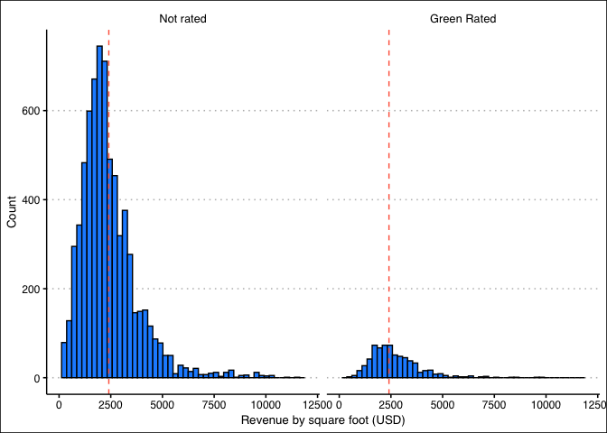<!-- -->

``` r
# tally by group (green rating)
green_build %>%
  mutate(green_rating = if_else(green_rating == 0, "No rating", "Green rating")) %>%
  group_by(green_rating) %>%
  tally() %>%
  rename(`Green Rating` = green_rating,
         Count = n) %>% 
  kable("pipe")
```

| Green Rating | Count |
|:-------------|------:|
| Green rating |   685 |
| No rating    |  7209 |

``` r
# Distro of revenue by class A
green_build %>%
  mutate(class_a = if_else(class_a == 0, "Other", "Class A")) %>%
  ggplot() + 
  geom_histogram(aes(x = rev_sqft, fill = factor(class_a)), 
                 bins = 50,
                 color = "black") +
  geom_vline(aes(xintercept = mean(rev_sqft)), 
             color = "green", linetype = 2) +
  # few outliers
  xlim(0, 12000) +
  labs(x = "Revenue by square foot (USD)", y = "Count",
       caption = "Note: Green = mean") + 
  scale_fill_brewer(palette = "Set1") +
  theme_clean() +
  theme(legend.title = element_blank())
```

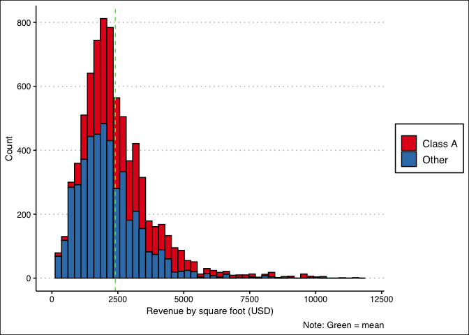<!-- -->

Now we can split into our train/test split and validate the samples with
cross-fold validation. We use these splits and folds across several
models.

``` r
# Split into train/test split
set.seed(395)
green_split <- initial_split(green_build, strata = rev_sqft)
green_train <- training(green_split)
green_test <- testing(green_split)

# v-fold
set.seed(3951)
green_folds <- vfold_cv(green_train, v = 3, strata = rev_sqft)
green_folds
```

    ## #  3-fold cross-validation using stratification 
    ## # A tibble: 3 x 2
    ##   splits            id   
    ##   <list>            <chr>
    ## 1 <split [3.9K/2K]> Fold1
    ## 2 <split [3.9K/2K]> Fold2
    ## 3 <split [3.9K/2K]> Fold3

Next, these data require feature engineering, so we exploit the
tidymodels recipe format to make these steps easily executable across
multiple models.

``` r
green_rec <- 
  recipe(rev_sqft ~ ., green_train) %>% 
  update_role(contains("id"), new_role = "ID") %>% # declare ID variables
  step_mutate(
    green_cert = case_when(
      leed == 1 ~ "leed",
      energystar == 1 ~ "energystar",
      leed == 0 & energystar == 0 ~ "none"
    )
  ) %>%
  step_rm(c(rent, leasing_rate, leed, energystar, green_rating, total_dd_07, city_market_rent)) %>% # remove confounders
  #step_bin2factor(c(green_rating)) %>% # binary to factor
  step_nzv(all_predictors(), freq_cut = 0, unique_cut = 0) %>% # remove variables with zero variances
  step_novel(all_nominal()) %>% # prepares test data to handle previously unseen factor levels 
  step_unknown(all_nominal()) %>% # categorizes missing categorical data (NA's) as `unknown`
  step_medianimpute(all_numeric(), -all_outcomes(), -has_role("ID"))  %>% # replaces missing numeric observations with the median
  step_dummy(all_nominal(), -has_role("ID")) # dummy codes categorical variables
```

Then, I have created three models: a decision tree, a KNN-regression,
and a LASSO regression.

### Decision Tree

First, we specify a model with tuneable hyperparameters and then create
a grid of tuning parameters.

``` r
# create tuneable dt model
tree_spec <- decision_tree(
  cost_complexity = tune(), # 0 > cp > tune()
  tree_depth = tune(),      # max tree depth
  min_n = tune()            # smallest node allowed
) %>%
  set_engine("rpart") %>%   # set tree engine
  set_mode("regression")

tree_spec
```

    ## Decision Tree Model Specification (regression)
    ## 
    ## Main Arguments:
    ##   cost_complexity = tune()
    ##   tree_depth = tune()
    ##   min_n = tune()
    ## 
    ## Computational engine: rpart

``` r
# create grids of tuning params
tree_grid <- 
  grid_regular(
    cost_complexity(), 
    tree_depth(), 
    min_n(), 
    levels = 4
    )

tree_grid
```

    ## # A tibble: 64 x 3
    ##    cost_complexity tree_depth min_n
    ##              <dbl>      <int> <int>
    ##  1    0.0000000001          1     2
    ##  2    0.0000001             1     2
    ##  3    0.0001                1     2
    ##  4    0.1                   1     2
    ##  5    0.0000000001          5     2
    ##  6    0.0000001             5     2
    ##  7    0.0001                5     2
    ##  8    0.1                   5     2
    ##  9    0.0000000001         10     2
    ## 10    0.0000001            10     2
    ## # … with 54 more rows

A model workflow allows me to rerun parts of the model easily.

``` r
# create workflow
wflow_tree <- 
  workflow() %>% 
  add_recipe(green_rec) %>%
  add_model(tree_spec)
```

Using the workflow, the hyperparameter tuning can be done with ease. We
run it in parallel to speed up computation time. Then we visualize
specified model metrics against tree depth.

``` r
# try all param values on resampled datasets
doParallel::registerDoParallel()

set.seed(3452)

tree_rs <- 
  tune_grid(
    wflow_tree,
    resamples = green_folds,
    grid = tree_grid, 
    metrics = metric_set(rmse, rsq, mae)
  )

tree_rs
```

    ## # Tuning results
    ## # 3-fold cross-validation using stratification 
    ## # A tibble: 3 x 4
    ##   splits            id    .metrics           .notes          
    ##   <list>            <chr> <list>             <list>          
    ## 1 <split [3.9K/2K]> Fold1 <tibble [192 × 7]> <tibble [0 × 1]>
    ## 2 <split [3.9K/2K]> Fold2 <tibble [192 × 7]> <tibble [0 × 1]>
    ## 3 <split [3.9K/2K]> Fold3 <tibble [192 × 7]> <tibble [0 × 1]>

``` r
# evaluate model
# collect_metrics(tree_rs)

autoplot(tree_rs) + theme_clean()
```

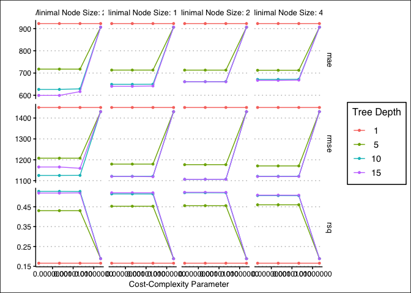<!-- -->

To apply this model to the test set, we select the model with the lowest
RMSE and fit the model to the test set.

``` r
lowest_tree_rmse <- select_best(tree_rs, "rmse")

## Out of sample performance

# finalize workflow
final_wf <- 
  wflow_tree %>% 
  finalize_workflow(lowest_tree_rmse)

final_wf
```

    ## ══ Workflow ════════════════════════════════════════════════════════════════════
    ## Preprocessor: Recipe
    ## Model: decision_tree()
    ## 
    ## ── Preprocessor ────────────────────────────────────────────────────────────────
    ## 7 Recipe Steps
    ## 
    ## ● step_mutate()
    ## ● step_rm()
    ## ● step_nzv()
    ## ● step_novel()
    ## ● step_unknown()
    ## ● step_medianimpute()
    ## ● step_dummy()
    ## 
    ## ── Model ───────────────────────────────────────────────────────────────────────
    ## Decision Tree Model Specification (regression)
    ## 
    ## Main Arguments:
    ##   cost_complexity = 0.0001
    ##   tree_depth = 15
    ##   min_n = 27
    ## 
    ## Computational engine: rpart

``` r
# fit the model (two ways, same thing)
final_rs <- last_fit(final_wf, green_split)

# tree_rs %>%
#   show_best(metric = "rmse")
```

``` r
# look at test data
collect_metrics(final_rs)[,1:3] %>% kbl(digits = 3, format = "pipe")
```

| .metric | .estimator | .estimate |
|:--------|:-----------|----------:|
| rmse    | standard   |   919.116 |
| rsq     | standard   |     0.609 |

``` r
# what are the most important variables
# final_wf %>% 
#   pull_workflow_fit() %>% 
#   vip(geom = "col", aesthetics = list(fill = "midnightblue", alpha = 0.8)) +
#   scale_y_continuous(expand = c(0, 0)) +
#   theme_clean()

# look at predictions
final_rs %>%
  collect_predictions() %>%
  ggplot(aes(rev_sqft, .pred)) +
  geom_abline(slope = 1, lty = 2, color = "gray50", alpha = 0.5) +
  geom_point(alpha = 0.6, color = "midnightblue") +
  theme_clean() +
  coord_fixed()
```

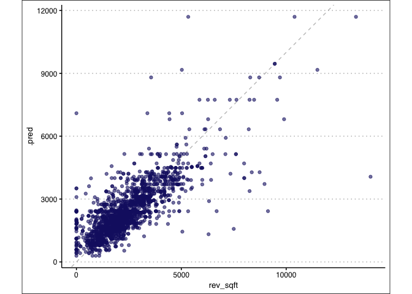<!-- -->

### KNN-regression

Similar to previous, I define a model engine with a tuneable K.

``` r
# set model with tuneable hyperparams
knn_spec <-
  nearest_neighbor(
    mode = "regression",
    neighbors = tune("K")
  ) %>%
  set_engine("kknn")

# construct workflow
wflow_knn <-
  workflow() %>% 
  add_recipe(green_rec) %>%
  add_model(knn_spec)

knn_set <-
  parameters(wflow_knn) %>%
  # try k in 1:50
  update(K = neighbors(c(1, 50)))

set.seed(3952)
knn_grid <-
  knn_set %>%
  grid_max_entropy(size = 50)

knn_grid_search <-
  tune_grid(
    wflow_knn,
    resamples = green_folds,
    grid = knn_grid
  )
```

After tuning the model, I select the best performing across the number
of neighbors and look at the out of sample performance.

``` r
# choose best model
lowest_rmse_knn <- select_best(knn_grid_search, "rmse")

best_k <- as.numeric(lowest_rmse_knn$K)

# plot rmse x K
collect_metrics(knn_grid_search) %>%
  filter(.metric == "rmse") %>% 
  ggplot() + 
  geom_vline(aes(xintercept = best_k), linetype = 2, color = "tomato") +
  geom_point(aes(x = K, y = mean), color = "midnightblue", alpha = 0.8) +
  labs(y = "RMSE") +
  theme_clean()
```

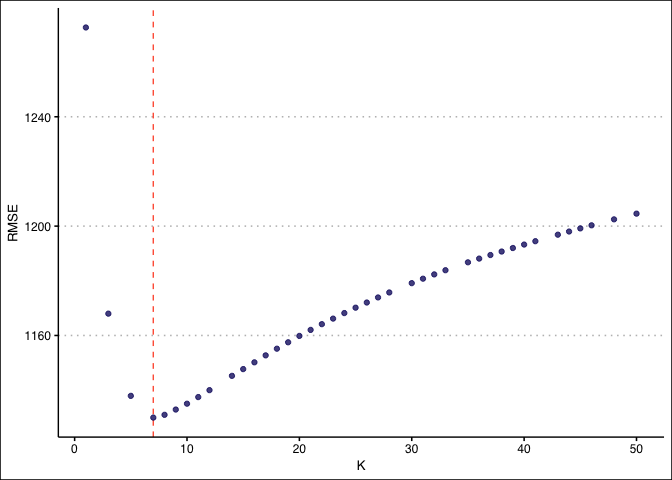<!-- -->

``` r
## Out of sample performance

# finalize workflow
final_wf_knn <- 
  wflow_knn %>% 
  finalize_workflow(lowest_rmse_knn)

final_wf_knn
```

    ## ══ Workflow ════════════════════════════════════════════════════════════════════
    ## Preprocessor: Recipe
    ## Model: nearest_neighbor()
    ## 
    ## ── Preprocessor ────────────────────────────────────────────────────────────────
    ## 7 Recipe Steps
    ## 
    ## ● step_mutate()
    ## ● step_rm()
    ## ● step_nzv()
    ## ● step_novel()
    ## ● step_unknown()
    ## ● step_medianimpute()
    ## ● step_dummy()
    ## 
    ## ── Model ───────────────────────────────────────────────────────────────────────
    ## K-Nearest Neighbor Model Specification (regression)
    ## 
    ## Main Arguments:
    ##   neighbors = 7
    ## 
    ## Computational engine: kknn

``` r
# fit the model 
last_fit(
  final_wf_knn,
  green_split
  ) %>%
  collect_metrics() %>% 
  select(1:3) %>%
  kbl(digits = 3, format = "pipe")
```

| .metric | .estimator | .estimate |
|:--------|:-----------|----------:|
| rmse    | standard   |   973.463 |
| rsq     | standard   |     0.565 |

### LASSO

Here, I construct a penalized regression, or LASSO model, with a
tuneable penalty.

``` r
lasso_spec <- 
  linear_reg(
    penalty = tune(), 
    mixture = 1
    ) %>%
  set_engine("glmnet")

# construct workflow
wflow_lasso <-
  workflow() %>% 
  add_recipe(green_rec) %>%
  add_model(lasso_spec)

lambda_grid <- grid_regular(penalty(), levels = 50)
```

``` r
doParallel::registerDoParallel()
set.seed(3955)
lasso_grid <- 
  tune_grid(
    wflow_lasso,
    resamples = green_folds,
    grid = lambda_grid
  )
```

``` r
lowest_rmse <- 
  lasso_grid %>%
  select_best("rmse")

final_lasso <- 
  finalize_workflow(
    wflow_lasso,
    lowest_rmse
  )

final_lasso %>%
  fit(green_train) %>%
  pull_workflow_fit() %>%
  vi(lambda = lowest_rmse$penalty) %>%
  mutate(
    Importance = abs(Importance),
    Variable = fct_reorder(Variable, Importance)
  ) %>%
  ggplot(aes(x = Importance, y = Variable, fill = Sign)) +
  geom_col() +
  scale_fill_brewer(palette = "Set1") +
  scale_x_continuous(expand = c(0, 0)) +
  labs(y = NULL) +
  theme_clean()
```

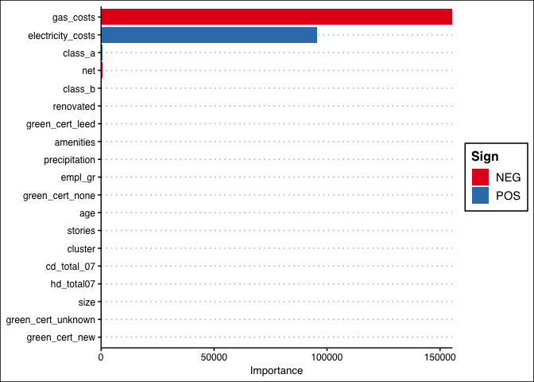<!-- -->

``` r
last_fit(
  final_lasso,
  green_split
  ) %>%
  collect_metrics() %>% 
  select(1:3) %>%
  kbl(digits = 3, format = "pipe")
```

| .metric | .estimator | .estimate |
|:--------|:-----------|----------:|
| rmse    | standard   |  1218.393 |
| rsq     | standard   |     0.305 |

## Predictive model building: California housing

In this problem, we exploit census-tract level data on residential
housing in California to build a predictive model for
`medianHouseValue`.

``` r
housing <- 
  read_data("CAhousing.csv") %>%
  janitor::clean_names()
```

Thankfully Professor Scott made this easier for us and eliminated all of
the missing values problems. Nice work there.

``` r
# cali <- ggmap(ggmap::get_stamenmap(location ='California', zoom = 6))
# ggmap(cali)

states <- map_data("state")
county <- map_data("county")
ca_df <- subset(states, region == "california")
ca_county <- subset(county, region == "california")

ca_base <- 
  ggplot() + 
  coord_fixed(1.3) + 
  geom_polygon(data = ca_df, 
               aes(x = long, y = lat, group = group),
               color = "black", fill = "white")  + 
  geom_polygon(data = ca_county, 
               aes(x = long, y = lat, group = group), 
               fill = NA, color = "gray") +
  geom_polygon(data = ca_df,
               aes(x = long, y = lat, group = group), 
               color = "black", fill = NA)

ca_base + 
  geom_point(data = housing, 
    aes(x = longitude, y = latitude, 
        color = median_house_value, size = population), 
    alpha = 0.4) +
  theme(plot.title = element_text(hjust = 0.5)) +
  theme_map() +
  scale_color_distiller(palette = "Spectral", labels = comma) +
  labs(title = "California Housing",
       x = "Longitude", y = "Latitude",
       color = "Median House Value (in $USD)", 
       size = "Population")
```

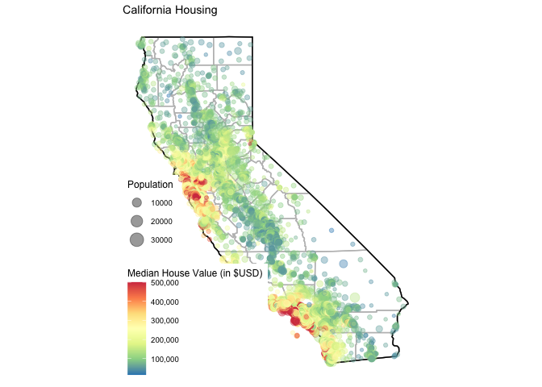<!-- -->

### Cleaning

The data is pretty clean, so there isn’t much feature engineering to do.

Here we create the train/test split.

``` r
set.seed(395)

# Create a split object
housing_split <- initial_split(housing, prop = 0.75, strata = median_house_value)

# Build training data set
housing_train <- housing_split %>% training()

# Build testing data set
housing_test <- housing_split %>% testing()

# vfold
housing_vfold <- vfold_cv(housing_train, v = 10, strata = median_house_value)
```

First, we can fit a basic linear model as a baseline. I do this as I’ve
done in previous problem sets using the `tidymodels` pipeline.

``` r
set.seed(395)

# specify a linear model
lm_model <- 
  linear_reg() %>% 
  set_engine('lm') %>% 
  set_mode('regression')

# define a recipe - FEATURE ENG
lm_recipe <- 
  # fit on all variables
  recipe(median_house_value ~ ., data = housing_train) %>%
  # log price
  step_log(median_house_value) %>%
  # standardize
  step_range(total_bedrooms, total_rooms, population, housing_median_age, median_income) %>%
  # specify tuning hyperparameters
  step_ns(longitude, deg_free = tune("long df")) %>% 
  step_ns(latitude,  deg_free = tune("lat df"))

# grid to tun long/lat
grid_vals <- seq(2, 22, by = 2)
# A regular grid:
spline_grid <- expand.grid(`long df` = grid_vals, `lat df` = grid_vals)

# which hyper param to tune
housing_param <- 
  lm_recipe %>% 
  parameters() %>% 
  update(
    `long df` = spline_degree(), 
    `lat df` = spline_degree()
  )

housing_param
```

    ## Collection of 2 parameters for tuning
    ## 
    ##  identifier     type    object
    ##     long df deg_free nparam[+]
    ##      lat df deg_free nparam[+]

``` r
# create a workflow
lm_workflow <- 
  workflow() %>% 
  # specify engine
  add_model(lm_model) %>% 
  # specify recipe
  add_recipe(lm_recipe)

tic()
lm_res <- 
  lm_workflow %>%
  tune_grid(resamples = housing_vfold, grid = spline_grid)
toc()
```

    ## 503.097 sec elapsed

``` r
lm_est <- collect_metrics(lm_res)

lm_rmse_vals <- 
  lm_est %>% 
  dplyr::filter(.metric == "rmse") %>% 
  arrange(mean)

lm_final <-
  lm_rmse_vals %>%
  filter(.metric == "rmse") %>%
  filter(mean == min(mean))


lm_final_workflow <- 
  lm_workflow %>% 
  finalize_workflow(lm_final)

# fit the model
lm_fit <- 
  # use the workflow with the best model ...
  lm_final_workflow %>% 
  # ... to fit the test set
  last_fit(split = housing_split)

# Obtain performance metrics on test data
lm_fit %>% collect_metrics()
```

    ## # A tibble: 2 x 4
    ##   .metric .estimator .estimate .config             
    ##   <chr>   <chr>          <dbl> <chr>               
    ## 1 rmse    standard       0.296 Preprocessor1_Model1
    ## 2 rsq     standard       0.728 Preprocessor1_Model1

Let’s plot spline functions. Looking at these plots, the smaller degrees
of freedom (red) are clearly under-fitting. Visually, the more complex
splines (blue) might indicate that there is overfitting but this would
result in poor RMSE values when computed on the hold-out data.

``` r
housing_train %>% 
  dplyr::select(median_house_value, longitude, latitude) %>% 
  tidyr::pivot_longer(cols = c(longitude, latitude), 
                      names_to = "predictor", values_to = "value") %>% 
  ggplot(aes(x = value, median_house_value)) + 
  geom_point(alpha = .2) + 
  geom_smooth(se = FALSE, method = lm, formula = y ~ splines::ns(x, df = 3),  col = "tomato") +
  geom_smooth(se = FALSE, method = lm, formula = y ~ splines::ns(x, df = 16)) +
  scale_y_log10() +
  theme_clean() +
  facet_wrap(~ predictor, scales = "free_x")
```

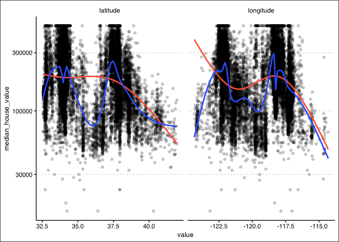<!-- -->

Let’s save predictions on the out-of-sample test set.

``` r
# Obtain test set predictions data frame
lm_results <- 
  lm_fit %>% 
  # save pred results
  collect_predictions()

# bind prediction columns
lm_results <- 
  lm_results %>% 
  bind_cols(housing_test) %>% 
  rename(median_house_value_log = `median_house_value...4`,
         median_house_value = `median_house_value...14`) 
```

Visually, how did we do?

``` r
# plot pred v actual
lm_results %>%
  ggplot(aes(x = .pred, y = median_house_value_log)) +
  geom_point(color = '#006EA1', alpha = 0.25)  +
  geom_abline(intercept = 0, slope = 1, color = 'tomato') +
  labs(title = 'Linear Regression Results - Test Set',
       x = 'Predicted Price',
       y = 'Actual Price') + 
  theme_clean()
```

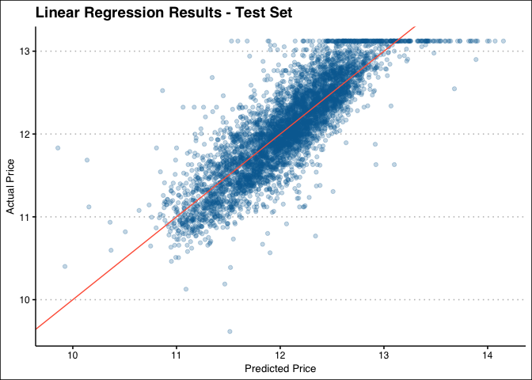<!-- -->

This looks okay. Let’s recreate the first map, but now looking at
predicted values. Not that the predicted values are log-price.

``` r
p1 <- 
  ca_base + 
  geom_point(data = lm_results, 
    aes(x = longitude, y = latitude, 
        color = .pred, size = population), 
    alpha = 0.4) +
  theme(plot.title = element_text(hjust = 0.5)) +
  theme_map() +
  scale_color_distiller(palette = "Spectral", labels = comma,
                        limits = c(9, 14)) +
  labs(title = "Predicted ",
       x = "Longitude", y = "Latitude",
       color = "Median House Value (in $USD)", 
       size = "Population")

p2 <- 
  ca_base + 
  geom_point(data = lm_results, 
    aes(x = longitude, y = latitude, 
        color = median_house_value_log, size = population), 
    alpha = 0.4) +
  theme(plot.title = element_text(hjust = 0.5)) +
  theme_map() +
  scale_color_distiller(palette = "Spectral", labels = comma,
                        limits = c(9, 14)) +
  labs(title = "Actual",
       x = "Longitude", y = "Latitude",
       color = "Median House Value (in $USD)", 
       size = "Population")

p1 + p2 + 
  plot_layout(guides = 'collect') +
  plot_annotation(title = "California Housing -- Linear Model")
```

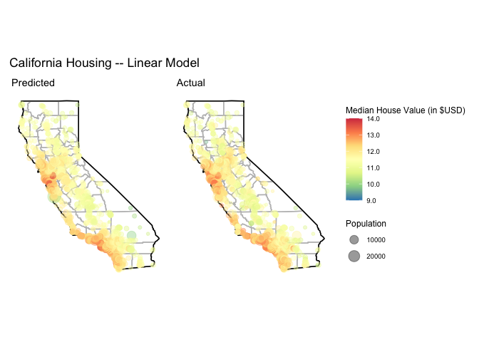<!-- -->

To see more concretely where this model was less accurate, we can plot
the error against the longitude and latitude. Here, green-to-blue means
the model guessed too high of a price and orange-to-red suggests the
model underestimated. It seems this model did quite well given the
amount fo yellow.

``` r
ca_base + 
  geom_point(data = lm_results, 
    aes(x = longitude, y = latitude, 
        color = median_house_value_log - .pred, size = population), 
    alpha = 0.4) +
  theme(plot.title = element_text(hjust = 0.5)) +
  theme_map() +
  scale_color_distiller(palette = "Spectral", labels = comma) +
  labs(title = "California Housing, log error",
       x = "Longitude", y = "Latitude",
       color = "Median House Value (in $USD)", 
       size = "Population")
```

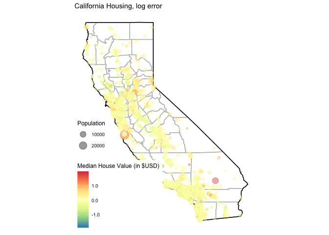<!-- -->

How does this compare to a KNN-regression? A KNN-regression might give
better performance with respect to the non-linearities in our features.

``` r
set.seed(395)

# specify a knn model
knn_model <- 
  # specify hyperparameters
  nearest_neighbor(neighbors = tune(), weight_func = tune()) %>% 
  set_engine('kknn') %>% 
  set_mode('regression') %>%
  translate()

# define a recipe
knn_recipe <- 
  # fit on all variables
  recipe(median_house_value ~ ., data = housing_train) %>%
  # log price
  step_log(median_house_value) %>%
  # standardize
  step_range(total_bedrooms, total_rooms, population, housing_median_age, median_income) %>%
  # specify tuning hyperparameters
  step_ns(longitude, deg_free = tune("long df")) %>% 
  step_ns(latitude,  deg_free = tune("lat df"))

# create a workflow
knn_workflow <- 
  workflow() %>% 
  # specify engine
  add_model(knn_model) %>% 
  # specify recipe
  add_recipe(knn_recipe)
```

After feature engineering and specifying the model, we tune the
hyperparameter

``` r
knn_param <- 
  knn_workflow %>% 
  # how to tune hyperparams
  parameters() %>% 
    update(
    `long df` = spline_degree(c(2, 18)), 
    `lat df` = spline_degree(c(2, 18)),
    neighbors = neighbors(c(3, 50)),
    weight_func = weight_func(values = c("rectangular", "inv", "triangular"))
  )

ctrl <- control_bayes(verbose = TRUE)

tic()
knn_search <- 
  tune_bayes(knn_workflow, resamples = housing_vfold, initial = 5, iter = 10,
                         param_info = knn_param, control = ctrl)
toc()
```

    ## 1190.249 sec elapsed

``` r
knn_final <-
  knn_search %>%
  collect_metrics() %>% 
  dplyr::filter(.metric == "rmse") %>% 
  filter(mean == min(mean))


knn_final_workflow <- 
  knn_workflow %>% 
  finalize_workflow(knn_final)

# fit the model
knn_fit <- 
  # use the workflow with the best model ...
  knn_final_workflow %>% 
  # ... to fit the test set
  last_fit(split = housing_split)

# Obtain performance metrics on test data
knn_fit %>% 
  collect_metrics() %>%
  select(1:3) %>%
  kbl(digits = 3, format = "pipe")
```

| .metric | .estimator | .estimate |
|:--------|:-----------|----------:|
| rmse    | standard   |     0.228 |
| rsq     | standard   |     0.839 |

We were able to get some gains over the linear model. Here is the final
model used:

``` r
knn_final_workflow
```

    ## ══ Workflow ════════════════════════════════════════════════════════════════════
    ## Preprocessor: Recipe
    ## Model: nearest_neighbor()
    ## 
    ## ── Preprocessor ────────────────────────────────────────────────────────────────
    ## 4 Recipe Steps
    ## 
    ## ● step_log()
    ## ● step_range()
    ## ● step_ns()
    ## ● step_ns()
    ## 
    ## ── Model ───────────────────────────────────────────────────────────────────────
    ## K-Nearest Neighbor Model Specification (regression)
    ## 
    ## Main Arguments:
    ##   neighbors = 7
    ##   weight_func = inv
    ## 
    ## Computational engine: kknn

Let’s save predictions on the out-of-sample test set.

``` r
# Obtain test set predictions data frame
knn_results <- 
  knn_fit %>% 
  # save pred results
  collect_predictions()
```

Visually, how did we do?

``` r
# plot pred v actual
knn_results %>%
  ggplot(aes(x = .pred, y = median_house_value)) +
  geom_point(color = '#006EA1', alpha = 0.25)  +
  geom_abline(intercept = 0, slope = 1, color = 'tomato') +
  labs(title = 'KNN Regression Results - Test Set',
       x = 'Predicted Price',
       y = 'Actual Price') + 
  theme_clean() 
```

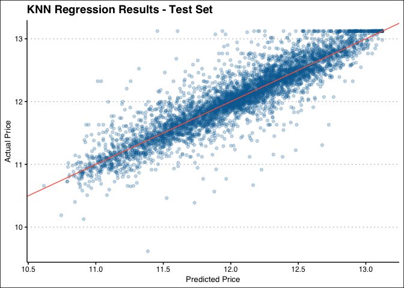<!-- -->

From the RMSE alone, this model is a bit better. To improve, we may have
to do some more feature engineering or use a different modeling
framework altogether.

Since this is the better model of the two, let’s look at the predicted
(log) residual as a deviation away from the true value:

``` r
# then use this map
knn_results <- 
  knn_results %>%
    bind_cols(housing_test) %>% 
    rename(median_house_value_log = `median_house_value...4`,
           median_house_value = `median_house_value...14`) 

knn_results %>% 
  arrange(median_house_value_log) %>%
  mutate(id = row_number()) %>%
  ggplot(aes(x = id, y = median_house_value_log)) + 
  geom_segment(aes(xend = id, yend = .pred), alpha = .2) +
  geom_point(aes(y = .pred), shape = 1) + 
  geom_point(color = "tomato", shape = 1, alpha = 0.5) +
  labs(x = "", y = "Logged median house value") + 
  theme_clean()
```

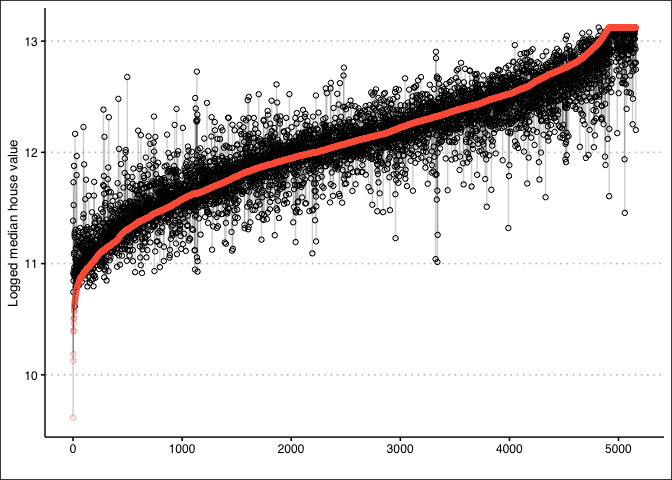<!-- -->

This model is fairly accurate, and the gains over the linear model are
marginal. The data set contains enough unique features that predicted
house value is not terribly difficult. The challenge is standardizing
and weighting variables appropriately, such as I have done with
spline-tuning the the longitude and latitude. I think a simpler model
controlling for census block or a binary `coastal` variable would be
equally effective. I imagine it is a strong indicator of price.

## Session Information

``` r
sessionInfo()
```

    ## R version 4.0.3 (2020-10-10)
    ## Platform: x86_64-apple-darwin17.0 (64-bit)
    ## Running under: macOS Big Sur 10.16
    ## 
    ## Matrix products: default
    ## BLAS:   /Library/Frameworks/R.framework/Versions/4.0/Resources/lib/libRblas.dylib
    ## LAPACK: /Library/Frameworks/R.framework/Versions/4.0/Resources/lib/libRlapack.dylib
    ## 
    ## locale:
    ## [1] en_US.UTF-8/en_US.UTF-8/en_US.UTF-8/C/en_US.UTF-8/en_US.UTF-8
    ## 
    ## attached base packages:
    ## [1] stats     graphics  grDevices utils     datasets  methods   base     
    ## 
    ## other attached packages:
    ##  [1] glmnet_4.1         Matrix_1.2-18      kknn_1.3.1         vctrs_0.3.4       
    ##  [5] rlang_0.4.10       baguette_0.1.0     rpart.plot_3.0.9   rpart_4.1-15      
    ##  [9] vip_0.3.2          mapdata_2.3.0      maps_3.3.0         ggmap_3.0.0       
    ## [13] patchwork_1.1.1    yardstick_0.0.7    workflows_0.2.1    tune_0.1.2        
    ## [17] rsample_0.0.8      recipes_0.1.15     parsnip_0.1.5      modeldata_0.1.0   
    ## [21] infer_0.5.4        dials_0.0.9        scales_1.1.1       broom_0.7.3       
    ## [25] tidymodels_0.1.2   janitor_2.1.0      estimatr_0.26.0    skimr_2.1.2       
    ## [29] modelsummary_0.6.1 kableExtra_1.2.1   tictoc_1.0         ggthemes_4.2.0    
    ## [33] forcats_0.5.0      stringr_1.4.0      dplyr_1.0.2        purrr_0.3.4       
    ## [37] readr_1.3.1        tidyr_1.1.2        tibble_3.0.5       ggplot2_3.3.3     
    ## [41] tidyverse_1.3.0   
    ## 
    ## loaded via a namespace (and not attached):
    ##   [1] readxl_1.3.1        backports_1.1.6     tidytext_0.2.5     
    ##   [4] igraph_1.2.6        plyr_1.8.6          repr_1.1.0         
    ##   [7] sp_1.4-2            splines_4.0.3       listenv_0.8.0      
    ##  [10] SnowballC_0.7.0     TH.data_1.0-10      digest_0.6.27      
    ##  [13] foreach_1.5.0       htmltools_0.4.0     earth_5.3.0        
    ##  [16] fansi_0.4.1         magrittr_2.0.1      doParallel_1.0.16  
    ##  [19] globals_0.14.0      modelr_0.1.7        gower_0.2.2        
    ##  [22] wordcloud_2.6       sandwich_3.0-0      hardhat_0.1.5      
    ##  [25] jpeg_0.1-8.1        colorspace_1.4-1    blob_1.2.1         
    ##  [28] rvest_0.3.6         haven_2.2.0         xfun_0.21          
    ##  [31] libcoin_1.0-8       crayon_1.3.4        jsonlite_1.7.1     
    ##  [34] survival_3.2-7      zoo_1.8-8           iterators_1.0.12   
    ##  [37] glue_1.4.2          gtable_0.3.0        ipred_0.9-9        
    ##  [40] emmeans_1.4.7       webshot_0.5.2       shape_1.4.4        
    ##  [43] mvtnorm_1.1-1       DBI_1.1.0           Rcpp_1.0.4.6       
    ##  [46] plotrix_3.7-8       viridisLite_0.3.0   xtable_1.8-4       
    ##  [49] Cubist_0.2.3        GPfit_1.0-8         statquotes_0.2.2   
    ##  [52] Formula_1.2-3       lava_1.6.8.1        prodlim_2019.11.13 
    ##  [55] httr_1.4.2          RColorBrewer_1.1-2  ellipsis_0.3.1     
    ##  [58] farver_2.0.3        pkgconfig_2.0.3     nnet_7.3-14        
    ##  [61] dbplyr_1.4.4        utf8_1.1.4          labeling_0.3       
    ##  [64] reshape2_1.4.4      tidyselect_1.1.0    DiceDesign_1.8-1   
    ##  [67] TeachingDemos_2.12  munsell_0.5.0       cellranger_1.1.0   
    ##  [70] tools_4.0.3         cli_2.2.0           generics_0.1.0     
    ##  [73] evaluate_0.14       yaml_2.2.1          tables_0.9.4       
    ##  [76] knitr_1.30          fs_1.5.0            RgoogleMaps_1.4.5.3
    ##  [79] nlme_3.1-149        future_1.21.0       xml2_1.3.2         
    ##  [82] tokenizers_0.2.1    compiler_4.0.3      rstudioapi_0.13    
    ##  [85] curl_4.3            png_0.1-7           reprex_0.3.0       
    ##  [88] lhs_1.1.1           stringi_1.5.3       highr_0.8          
    ##  [91] plotmo_3.6.0        lattice_0.20-41     pillar_1.4.4       
    ##  [94] lifecycle_0.2.0     furrr_0.2.1         estimability_1.3   
    ##  [97] bitops_1.0-6        R6_2.4.1            C50_0.1.3.1        
    ## [100] gridExtra_2.3       janeaustenr_0.1.5   parallelly_1.23.0  
    ## [103] codetools_0.2-16    MASS_7.3-53         assertthat_0.2.1   
    ## [106] rjson_0.2.20        withr_2.2.0         multcomp_1.4-14    
    ## [109] mgcv_1.8-33         parallel_4.0.3      hms_0.5.3          
    ## [112] grid_4.0.3          timeDate_3043.102   class_7.3-17       
    ## [115] inum_1.0-3          rmarkdown_2.5       snakecase_0.11.0   
    ## [118] partykit_1.2-13     pROC_1.17.0.1       lubridate_1.7.8    
    ## [121] base64enc_0.1-3
