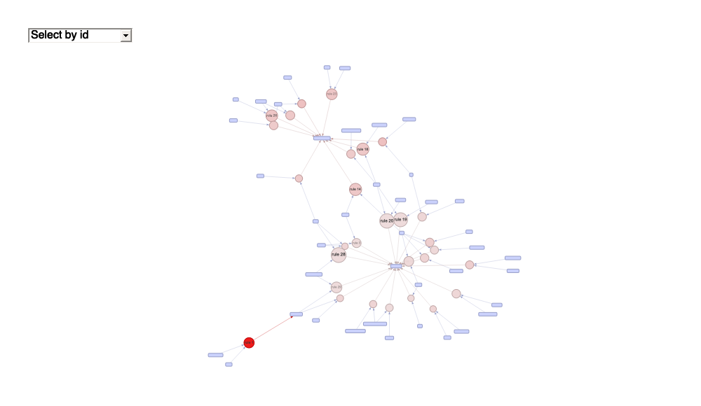

Exercise 04
================
Scott Cohn
Last compiled on 04 April, 2021

``` r
# funcs
read_data <- function(df) {
  #' read data from git url
  #' INPUT: data set name
  #' OUTPUT: dataframe
  full_path <- paste("https://raw.githubusercontent.com/jgscott/ECO395M/master/data/", 
                     df, sep = "")
  df <- read_csv(full_path)
  return(df)
}
```

## Clustering and PCA

## Market Segmentation

## Association Rules for Grocery Purchases

``` r
data("Groceries")

rules <- apriori(Groceries, parameter = list(supp = 0.001, conf = 0.8, maxlen = 3)) # Min Support as 0.001, confidence as 0.8.
```

    ## Apriori
    ## 
    ## Parameter specification:
    ##  confidence minval smax arem  aval originalSupport maxtime support minlen
    ##         0.8    0.1    1 none FALSE            TRUE       5   0.001      1
    ##  maxlen target  ext
    ##       3  rules TRUE
    ## 
    ## Algorithmic control:
    ##  filter tree heap memopt load sort verbose
    ##     0.1 TRUE TRUE  FALSE TRUE    2    TRUE
    ## 
    ## Absolute minimum support count: 9 
    ## 
    ## set item appearances ...[0 item(s)] done [0.00s].
    ## set transactions ...[169 item(s), 9835 transaction(s)] done [0.01s].
    ## sorting and recoding items ... [157 item(s)] done [0.00s].
    ## creating transaction tree ... done [0.00s].
    ## checking subsets of size 1 2 3 done [0.01s].
    ## writing ... [29 rule(s)] done [0.00s].
    ## creating S4 object  ... done [0.00s].

``` r
plot(rules, engine = "ggplot") + theme_clean()
```

<!-- -->

``` r
plot(rules, method = "graph", control = list(type = "items"), engine = "visNetwork")
```

    ## Available control parameters (with default values):
    ## itemCol   =  #CBD2FC
    ## nodeCol   =  c("#EE0000", "#EE0303", "#EE0606", "#EE0909", "#EE0C0C", "#EE0F0F", "#EE1212", "#EE1515", "#EE1818", "#EE1B1B", "#EE1E1E", "#EE2222", "#EE2525", "#EE2828", "#EE2B2B", "#EE2E2E", "#EE3131", "#EE3434", "#EE3737", "#EE3A3A", "#EE3D3D", "#EE4040", "#EE4444", "#EE4747", "#EE4A4A", "#EE4D4D", "#EE5050", "#EE5353", "#EE5656", "#EE5959", "#EE5C5C", "#EE5F5F", "#EE6262", "#EE6666", "#EE6969", "#EE6C6C", "#EE6F6F", "#EE7272", "#EE7575", "#EE7878", "#EE7B7B", "#EE7E7E", "#EE8181", "#EE8484", "#EE8888", "#EE8B8B",  "#EE8E8E", "#EE9191", "#EE9494", "#EE9797", "#EE9999", "#EE9B9B", "#EE9D9D", "#EE9F9F", "#EEA0A0", "#EEA2A2", "#EEA4A4", "#EEA5A5", "#EEA7A7", "#EEA9A9", "#EEABAB", "#EEACAC", "#EEAEAE", "#EEB0B0", "#EEB1B1", "#EEB3B3", "#EEB5B5", "#EEB7B7", "#EEB8B8", "#EEBABA", "#EEBCBC", "#EEBDBD", "#EEBFBF", "#EEC1C1", "#EEC3C3", "#EEC4C4", "#EEC6C6", "#EEC8C8", "#EEC9C9", "#EECBCB", "#EECDCD", "#EECFCF", "#EED0D0", "#EED2D2", "#EED4D4", "#EED5D5", "#EED7D7", "#EED9D9", "#EEDBDB", "#EEDCDC", "#EEDEDE", "#EEE0E0",  "#EEE1E1", "#EEE3E3", "#EEE5E5", "#EEE7E7", "#EEE8E8", "#EEEAEA", "#EEECEC", "#EEEEEE")
    ## precision     =  3
    ## igraphLayout  =  layout_nicely
    ## interactive   =  TRUE
    ## engine    =  visNetwork
    ## max   =  100
    ## selection_menu    =  TRUE
    ## degree_highlight  =  1
    ## verbose   =  FALSE

<!-- -->

## Author Attribution

## Session Information

``` r
sessionInfo()
```

    ## R version 4.0.3 (2020-10-10)
    ## Platform: x86_64-apple-darwin17.0 (64-bit)
    ## Running under: macOS Big Sur 10.16
    ## 
    ## Matrix products: default
    ## BLAS:   /Library/Frameworks/R.framework/Versions/4.0/Resources/lib/libRblas.dylib
    ## LAPACK: /Library/Frameworks/R.framework/Versions/4.0/Resources/lib/libRlapack.dylib
    ## 
    ## locale:
    ## [1] en_US.UTF-8/en_US.UTF-8/en_US.UTF-8/C/en_US.UTF-8/en_US.UTF-8
    ## 
    ## attached base packages:
    ## [1] stats     graphics  grDevices utils     datasets  methods   base     
    ## 
    ## other attached packages:
    ##  [1] SnowballC_0.7.0    tm_0.7-7           NLP_0.2-1          arulesViz_1.4-0   
    ##  [5] arules_1.6-7       Matrix_1.2-18      patchwork_1.1.1    yardstick_0.0.7   
    ##  [9] workflows_0.2.1    tune_0.1.2         rsample_0.0.8      recipes_0.1.15    
    ## [13] parsnip_0.1.5      modeldata_0.1.0    infer_0.5.4        dials_0.0.9       
    ## [17] scales_1.1.1       broom_0.7.3        tidymodels_0.1.2   janitor_2.1.0     
    ## [21] estimatr_0.26.0    skimr_2.1.2        modelsummary_0.6.1 kableExtra_1.2.1  
    ## [25] tictoc_1.0         ggthemes_4.2.0     forcats_0.5.0      stringr_1.4.0     
    ## [29] dplyr_1.0.2        purrr_0.3.4        readr_1.3.1        tidyr_1.1.2       
    ## [33] tibble_3.0.5       ggplot2_3.3.3      tidyverse_1.3.0   
    ## 
    ## loaded via a namespace (and not attached):
    ##   [1] readxl_1.3.1       backports_1.1.6    tidytext_0.2.5    
    ##   [4] plyr_1.8.6         repr_1.1.0         splines_4.0.3     
    ##   [7] listenv_0.8.0      TH.data_1.0-10     digest_0.6.27     
    ##  [10] foreach_1.5.0      htmltools_0.4.0    fansi_0.4.1       
    ##  [13] magrittr_2.0.1     globals_0.14.0     modelr_0.1.7      
    ##  [16] gower_0.2.2        wordcloud_2.6      sandwich_3.0-0    
    ##  [19] colorspace_1.4-1   blob_1.2.1         rvest_0.3.6       
    ##  [22] haven_2.2.0        xfun_0.21          crayon_1.3.4      
    ##  [25] jsonlite_1.7.1     survival_3.2-7     zoo_1.8-8         
    ##  [28] iterators_1.0.12   glue_1.4.2         registry_0.5-1    
    ##  [31] gtable_0.3.0       ipred_0.9-9        emmeans_1.4.7     
    ##  [34] webshot_0.5.2      mvtnorm_1.1-1      DBI_1.1.0         
    ##  [37] Rcpp_1.0.4.6       viridisLite_0.3.0  xtable_1.8-4      
    ##  [40] GPfit_1.0-8        statquotes_0.2.2   Formula_1.2-3     
    ##  [43] lava_1.6.8.1       prodlim_2019.11.13 httr_1.4.2        
    ##  [46] RColorBrewer_1.1-2 ellipsis_0.3.1     pkgconfig_2.0.3   
    ##  [49] farver_2.0.3       nnet_7.3-14        dbplyr_1.4.4      
    ##  [52] labeling_0.3       tidyselect_1.1.0   rlang_0.4.10      
    ##  [55] DiceDesign_1.8-1   munsell_0.5.0      cellranger_1.1.0  
    ##  [58] tools_4.0.3        cli_2.2.0          generics_0.1.0    
    ##  [61] evaluate_0.14      yaml_2.2.1         tables_0.9.4      
    ##  [64] knitr_1.30         fs_1.5.0           future_1.21.0     
    ##  [67] slam_0.1-47        xml2_1.3.2         tokenizers_0.2.1  
    ##  [70] compiler_4.0.3     rstudioapi_0.13    reprex_0.3.0      
    ##  [73] lhs_1.1.1          stringi_1.5.3      lattice_0.20-41   
    ##  [76] vctrs_0.3.4        pillar_1.4.4       lifecycle_0.2.0   
    ##  [79] furrr_0.2.1        estimability_1.3   seriation_1.2-9   
    ##  [82] R6_2.4.1           TSP_1.1-10         janeaustenr_0.1.5 
    ##  [85] parallelly_1.23.0  codetools_0.2-16   MASS_7.3-53       
    ##  [88] assertthat_0.2.1   withr_2.2.0        multcomp_1.4-14   
    ##  [91] parallel_4.0.3     hms_0.5.3          grid_4.0.3        
    ##  [94] rpart_4.1-15       timeDate_3043.102  class_7.3-17      
    ##  [97] rmarkdown_2.5      snakecase_0.11.0   pROC_1.17.0.1     
    ## [100] lubridate_1.7.8    base64enc_0.1-3
